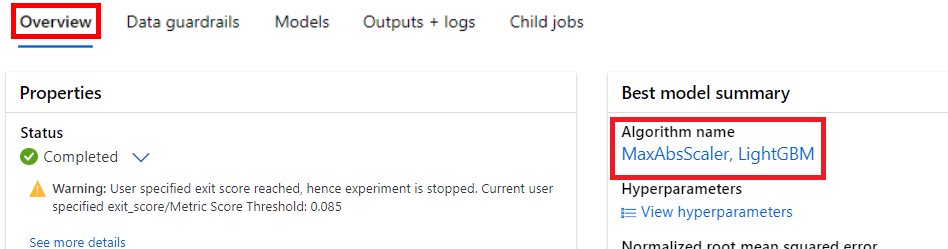

---
lab:
  title: 探索 Azure ML 中的自動化機器學習
  module: Module 2 - Machine Learning
---

# <a name="explore-automated-machine-learning-in-azure-ml"></a>探索 Azure ML 中的自動化機器學習

> **注意** 若要完成此實驗室，您需要一個具備[系統管理存取權](https://azure.microsoft.com/free?azure-portal=true)的 Azure 訂用帳戶。

在此練習下，您將使用自行車租借歷史詳細資料的資料集將模型定型，該模型會根據季節和氣象特徵，預測指定日期預期的自行車租借數目。

## <a name="create-an-azure-machine-learning-workspace"></a>建立 Azure Machine Learning 工作區  

1. 使用您的 Microsoft 登入資訊登入 [Azure 入口網站](https://portal.azure.com?azure-portal=true)。

1. 選取 [+ 建立資源] ，搜尋 Machine Learning，然後使用 *Azure Machine Learning* 方案建立新的 **Azure Machine Learning** 資源。 套用下列設定： 
    - **訂用帳戶**：*您的 Azure 訂用帳戶*。
    - **資源群組**：建立或選取資源群組。
    - **工作區名稱**：為您的工作區輸入唯一名稱。
    - **區域**：選取最接近的地理區域。
    - **儲存體帳戶**：留意將為您的工作區建立的預設新儲存體帳戶。
    - **金鑰保存庫**：留意將為您的工作區建立的預設新金鑰保存庫。
    - **應用程式見解**：留意將為您的工作區建立的預設新應用程式見解資源。
    - **容器登錄**：無 (第一次將模型部署到容器時會自動建立)。

1. 選取 [檢閱 + 建立]  ，然後選取 [建立]  。 等候工作區建立 (可能需要幾分鐘)，然後移至已部署的資源。

1. 選取 [啟動工作室] (或開啟新的瀏覽器索引標籤，並瀏覽至 [https://ml.azure.com](https://ml.azure.com?azure-portal=true)，然後使用您的 Microsoft 帳戶登入 Azure Machine Learning 工作室)。

1. 如果出現**目前有哪些機器學習目標?** 訊息，請選取 [取消]。

1. 如果出現**歡迎使用工作室!** 訊息，請選取 **X**。

1. 在 Azure Machine Learning 工作室中，您應該會看到新建立的工作區。 否則，請按一下左側功能表上的 [Microsoft]。 然後，從新的左側功能表中選取 [工作區]，其中會列出與您的訂用帳戶相關聯的所有工作區。 選擇您為此練習建立的工作區。 

> **注意** 這是眾多利用 Azure Machine Learning 工作區的課程模組之一，包括 [Microsoft Azure AI 基本概念：探索機器學習的視覺工具](https://docs.microsoft.com/learn/paths/create-no-code-predictive-models-azure-machine-learning/)學習路徑中的其他課程模組。 如果您使用的是您個人的 Azure 訂用帳戶，請考慮建立工作區一次，然後在其他模組中重複使用該工作區。 只要您的訂用帳戶中具有 Azure Machine Learning 工作區，您的 Azure 訂用帳戶就會為了資料儲存空間向您收取少量的費用，因此我們建議當您不再需要 Azure Machine Learning 工作區時，將其刪除。

## <a name="create-compute"></a>建立計算

1. 在 [Azure Machine Learning 工作室](https://ml.azure.com?azure-portal=true)中，選取左上方的三條線，以檢視介面中各個頁面 (您可能需要將畫面放到最大)。 您可以使用左側窗格中的頁面來管理工作區中的資源。 選取 [計算] 頁面 (在 [管理] 下)。

1. 在 [計算] 頁面上，選取 [計算叢集] 索引標籤，然後使用下列設定新增計算叢集。 您將使用此計算叢集來定型機器學習模型：
    - **位置**：選取與您的工作區相同的位置。如果未列出該位置，請選擇最接近您的位置。
    - **虛擬機器層**：專用
    - **虛擬機器類型**：CPU
    - **虛擬機器大小**：
        - 選擇 [從所有選項中選取]
        - 搜尋並選取 [Standard_DS11_v2]
    - 選取 [**下一步**]
    - **計算名稱**：輸入唯一名稱。
    - **節點數量下限**：0
    - **節點數量上限**：2
    - **相應減少之前的閒置秒數**：120
    - **啟用 SSH 存取**：清除
    - 選取 [建立] 

> **注意** 計算執行個體和叢集是以標準 Azure 虛擬機器映像為基礎。 針對本課程模組，建議使用 *Standard_DS11_v2* 映像，以達到最佳的成本與效能平衡。 如果您的訂用帳戶具有不包含此映像的配額，請選擇替代映像；但請記得，較大的映像可能會產生較高的成本，而較小的映像可能不足以完成工作。 或者，請要求您的 Azure 系統管理員擴大您的配額。

建立計算叢集需要一些時間。 您可以在等待期間先移至下一個步驟。

## <a name="create-a-dataset"></a>建立資料集

1. 在網頁瀏覽器中查看逗點分隔的資料 [https://aka.ms/bike-rentals](https://aka.ms/bike-rentals?azure-portal=true)。

1. 在 [Azure Machine Learning 工作室](https://ml.azure.com?azure-portal=true)中，選取畫面左上方的三條線來展開左窗格。 檢視 [資產] 底下的 [資料] 頁面。 [資料] 頁面具有您計劃在 Azure ML 中使用的特定資料檔案或資料表。 您也可以從此頁面建立資料集。

1. 在 [資料] 頁面的 [資料資產] 索引標籤下，選取 [建立]。 然後使用下列設定來設定資料資產：
    * **資料類型**：
        * **名稱**：bike-rentals
        * **描述**：自行車租借資料
        * **資料集類型**：表格式
    * **資料來源**：從 Web 檔案
    * **Web URL**： 
        * **Web URL**：[https://aka.ms/bike-rentals](https://aka.ms/bike-rentals?azure-portal=true)
        * **略過資料驗證**：*請不要選取*
    * **設定**：
        * **檔案格式**：分隔
        * **分隔符號**：逗號
        * **編碼**：UTF-8
        * **資料行標頭**：只有第一個檔案具有標頭
        * **跳過資料列**：無
        * 　　　　　　　**資料集包含多行資料**：請勿選取
    * **結構描述**：
        * 包含 [路徑] 以外的所有欄
        * 檢閱自動偵測到的類型
    * **檢閱**
        * 選取 [建立] 

1. 建立資料集之後，請加以開啟，並檢視 [探索] 頁面，以查看資料的範例。 此資料包含自行車租借的歷史特徵與標籤。

> **引文**：此資料衍生自 [Capital Bikeshare](https://www.capitalbikeshare.com/system-data)，並按照已發佈的資料[授權合約](https://www.capitalbikeshare.com/data-license-agreement)來使用。

## <a name="run-an-automated-machine-learning-job"></a>執行自動化機器學習作業

請依照下列步驟執行作業，利用自動化機器學習來定型迴歸模型，以預測自行車租借。

1. 在 [Azure Machine Learning Studio](https://ml.azure.com?azure-portal=true) 中，檢視 [自動化 ML] 頁面 (位在 [作者] 下)。

1. 使用下列設定建立自動化 ML 作業：
    - **選取資料資產**：
        - **資料集**：bike-rentals
    - **設定作業**：
        - **新的實驗名稱**：mslearn-bike-rental
        - **目標資料行**：租借 (這是將模型定型以預測的標籤)
        - **選取 Azure ML 計算叢集**：您先前建立的計算叢集。
    - **選取工作和設定**：  
        - **工作類型**：迴歸 (模型會預測數值) 

    ![選取窗格的螢幕擷取畫面，其中已框住 [迴歸] 工作類型及其他組態設定。](media/use-automated-machine-learning/new-automated-ml-run-4.png)

    請注意，在工作類型下有 [檢視其他組態設定] 和 [檢視特徵化設定] 這兩項設定。 現在設定下列設定。

    - **其他組態設定：**
        - **主要計量**：選取 [標準化均方根誤差]
        - **解釋最佳模型**：已選取 - 此選項會導致自動化機器學習計算最佳模型的特徵重要度，讓您能夠判斷每個特徵對已預測標籤的影響。
        - **使用所有支援的模型**：<u>未</u>選取。 您將限制作業只嘗試幾個特定演算法。
        - **允許的模型**：只選取 **RandomForest** 和 **LightGBM** - 通常建議盡可能嘗試，但每新增一個模型就會增加執行作業所需的時間。

        
        - **結束準則**：
            - **定型作業時間 (小時)** ：0.5 - 最長 30 分鐘後結束作業。
            - **計量分數閾值**：0.085 - 模型達到 0.085 或更小的標準化均方根誤差計量分數時，作業就結束。
        - **並行**：請勿變更
    - **特徵化設定：**
        - **啟用特徵化**：已選取 - 在定型之前自動預先處理特徵。

    按 [下一步] 以移至下一個選取窗格。

    - **選取驗證和測試類型**
        - **驗證類型**：自動
        - **測試資料資產 (預覽)** ：不需要測試資料資產

1. 完成提交自動化機器學習作業詳細資料時，作業就自動開始。 等待狀態從「正在準備」變成「正在執行」。

1. 當狀態變成「正在執行」時，檢視 [模型] 索引標籤，並觀察已嘗試的定型演算法和預先處理步驟的各種可能組合，以及結果模型的效能評估。 此頁面會定期自動重新整理，但您也可以選取 [重新整理]。 可能需要 10 分鐘左右的時間才會開始顯示模型，因為叢集節點必須先初始化才能開始定型。

1. 請等候作業完成。 這可能需要一些時間，現在或許是喝咖啡休息的好時機！

## <a name="review-the-best-model"></a>檢閱最佳模型

1. 在自動化機器學習作業的 [概觀] 索引標籤上，留意最佳模型摘要。
    

    >[!NOTE]
    > 您可能會在狀態下看到「警告: 使用者指定的退出分數已達到...」訊息。 這是預期的訊息。 請繼續下一個步驟。  
1. 選取最佳模型 [演算法名稱] 下方的文字，以檢視其詳細資料。

1. 在 [正規化均方根誤差] 值的旁邊，選取 [檢視所有其他計量] 以查看迴歸模型其他可能評估計量的值。

    ![螢幕擷取畫面顯示如何在 [模型] 索引標籤上尋找 [檢視所有其他計量]。](media/use-automated-machine-learning/review-run-1.png)

1. 選取 [計量] 索引標籤，然後選取**殘差**與 **predicted_true** 圖表 (如果尚未選取)。 
    ![[計量] 索引標籤的螢幕擷取畫面，其中已選取 residuals 和 predicted_true 圖表。](media/use-automated-machine-learning/review-run-3.png)

    檢閱顯示模型效能的圖表。 第一個圖表以長條圖顯示「殘差」，也就是預測值與實際值之間的差異；第二個圖表則比較預測值與實際值。

1. 選取 [解釋] 索引標籤。選取解釋識別碼，然後選取 [彙總特徵重要度]。 此圖表會顯示資料集內的每個特徵影響標籤預測的程度，如下所示：

    ![螢幕擷取畫面顯示 [解釋] 索引標籤上的特徵重要度圖表。](media/use-automated-machine-learning/feature-importance.png)

## <a name="deploy-a-predictive-service"></a>部署預測性服務

1. 在 [Azure Machine Learning 工作室](https://ml.azure.com?azure-portal=true)的 [自動化 ML] 頁面上，選取您的自動化機器學習作業。

1. 在 [概觀] 索引標籤上，選取最佳模型的演算法名稱。

    

1. 在 [模型] 索引標籤上，選取 [部署] 按鈕，然後使用 [部署至 Web 服務] 選項，搭配下列設定來部署模型：
    - **名稱**：predict-rentals
    - **描述**：預測自行車租借
    - **計算類型**：Azure 容器執行個體
    - **啟用驗證**：已選取

1. 等待部署啟動，這可能需要幾秒鐘的時間。 接著，在 [模型摘要] 區段中，觀察 **predict-rentals** 服務的 [部署狀態]，此狀態應該是 [正在執行]。 等候此狀態變更為**已成功**，這可能需要一些時間。 您可能需要定期選取 [重新整理]。

1. 在 Azure Machine Learning 工作室中，選取左側功能表上的 [端點]。
    ![螢幕擷取畫面顯示左側功能表上的 [端點] 位置。](media/use-automated-machine-learning/find-endpoints.png)

## <a name="test-the-deployed-service"></a>測試已部署的服務

現在您可以測試已部署的服務。

1. 在 [端點] 頁面上，開啟 **predict-rentals** 即時端點。

1. 當 **predict-rentals** 端點開啟時，請檢視 [測試] 索引標籤。

1. 在 [輸入資料以測試即時端點] 窗格中，將範本 JSON 換成下列輸入資料：

    ```JSON
    {
      "Inputs": { 
        "data": [
          {
            "day": 1,
            "mnth": 1,   
            "year": 2022,
            "season": 2,
            "holiday": 0,
            "weekday": 1,
            "workingday": 1,
            "weathersit": 2, 
            "temp": 0.3, 
            "atemp": 0.3,
            "hum": 0.3,
            "windspeed": 0.3 
          }
        ]    
      },   
      "GlobalParameters": 1.0
    }
    ```

1. 按一下 [測試] 按鈕。

1. 檢閱測試結果，其中包含根據輸入特徵預測的租賃次數。 測試窗格取得輸入資料，並使用您定型的模型，以傳回預測的租賃次數。

    ![螢幕擷取畫面示範在 [測試] 索引標籤中使用樣本資料來測試模型。](media/use-automated-machine-learning/workaround-test.png)

讓我們檢閱您已完成的工作。 您已使用歷程記錄自行車租借資料的資料集來定型模型。 此模型會根據季節性和氣象*特徵*，預測指定一天預期的自行車租借數量。 在此案例中，*標籤*是自行車租借的數量。

您剛剛測試了準備好使用 [取用] 索引標籤中的認證連線至用戶端應用程式的服務。我們將到此結束實驗室。 歡迎繼續使用您剛才部署的服務進行更多試驗。

## <a name="clean-up"></a>清除

您建立的 Web 服務會裝載在 *Azure 容器執行個體*中。 如果不打算進一步試驗此服務，則應刪除端點，以避免產生不必要的 Azure 使用量。 您也應停止計算執行個體，直到再次需要為止。

1. 在 [Azure Machine Learning Studio](https://ml.azure.com?azure-portal=true) 的 [端點] 索引標籤上，選取 **predict-rentals** 端點。 然後，選取 [刪除]，並確認您想要刪除該端點。
2. 在 [計算] 頁面的 [計算執行個體] 索引標籤中，選取計算執行個體，然後選取 [停止]。

>[!NOTE]
> 停止您的計算可確保您的訂用帳戶不需支付計算資源的費用。 不過，只要您的訂用帳戶中具有 Azure Machine Learning 工作區，您就必須為了資料儲存空間支付少許的費用。 如果您已完成探索 Azure Machine Learning，則可刪除 Azure Machine Learning 工作區及其相關的資源。 但是，如果您打算完成本系列中的任何其他實驗室，您將需要重新建立 Azure Machine Learning 工作區。
>
> 若要刪除您的工作區：
> 1. 在 [Azure 入口網站](https://portal.azure.com?azure-portal=true)的 [資源群組] 頁面中，開啟您在建立 Azure Machine Learning 工作區時所指定的資源群組。
> 2. 按一下 [刪除資源群組]、輸入資源群組名稱以確認要刪除，然後選取 [刪除]。