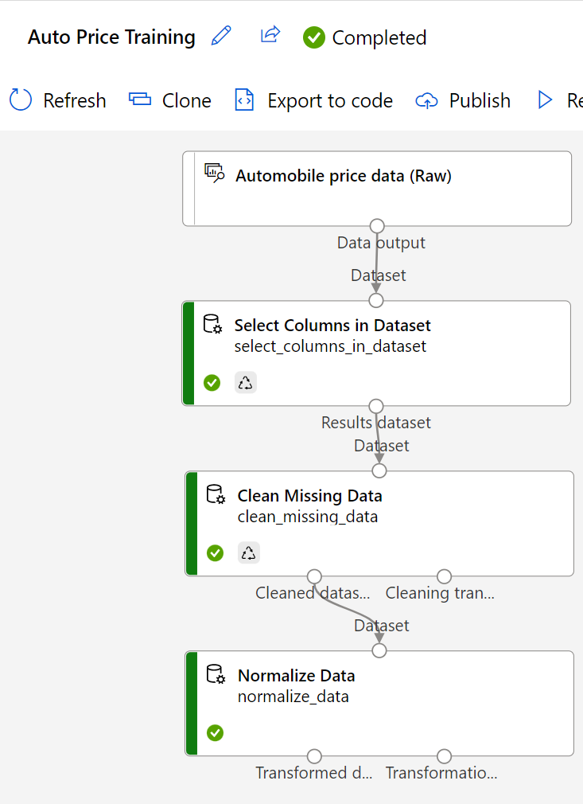

---
lab:
  title: 使用 Azure Machine Learning 設計工具探索迴歸
  module: Module 2 - Machine Learning
---

# <a name="explore-regression-with-azure-machine-learning-designer"></a>使用 Azure Machine Learning 設計工具探索迴歸

> **注意** 若要完成此實驗室，您需要一個具備[系統管理存取權](https://azure.microsoft.com/free?azure-portal=true)的 Azure 訂用帳戶。

在此練習中，您會定型迴歸模型，以根據特性預測汽車的價格。

## <a name="create-an-azure-machine-learning-workspace"></a>建立 Azure Machine Learning 工作區  

1. 使用您的 Microsoft 登入資訊登入 [Azure 入口網站](https://portal.azure.com?azure-portal=true)。

1. 選取 [+ 建立資源] ，搜尋 Machine Learning，然後使用 *Azure Machine Learning* 方案建立新的 **Azure Machine Learning** 資源。 套用下列設定： 
    - **訂用帳戶**：*您的 Azure 訂用帳戶*。
    - **資源群組**：建立或選取資源群組。
    - **工作區名稱**：為您的工作區輸入唯一名稱。
    - **區域**：選取最接近的地理區域。
    - **儲存體帳戶**：留意將為您的工作區建立的預設新儲存體帳戶。
    - **金鑰保存庫**：留意將為您的工作區建立的預設新金鑰保存庫。
    - **應用程式見解**：留意將為您的工作區建立的預設新應用程式見解資源。
    - **容器登錄**：無 (*在您第一次將模型部署至容器時，系統將會自動建立一個容器登錄*)

1. 選取 [檢閱 + 建立]，然後選取 [建立]。 等候工作區建立 (可能需要幾分鐘)，然後移至已部署的資源。

1. 選取 [啟動工作室] (或開啟新的瀏覽器索引標籤，並瀏覽至 [https://ml.azure.com](https://ml.azure.com?azure-portal=true)，然後使用您的 Microsoft 帳戶登入 Azure Machine Learning 工作室)。

1. 在 Azure Machine Learning 工作室中，您應該會看到新建立的工作區。 否則，請按一下左側功能表上的 [Microsoft]。 然後，從新的左側功能表中選取 [工作區]，其中會列出與您的訂用帳戶相關聯的所有工作區。 選擇您為此練習建立的工作區。 

> **注意** 這是眾多利用 Azure Machine Learning 工作區的課程模組之一，包括 [Microsoft Azure AI 基本概念：探索機器學習的視覺工具](https://docs.microsoft.com/learn/paths/create-no-code-predictive-models-azure-machine-learning/)學習路徑中的其他課程模組。 如果您使用的是您個人的 Azure 訂用帳戶，請考慮建立工作區一次，然後在其他模組中重複使用該工作區。 只要您的訂用帳戶中具有 Azure Machine Learning 工作區，您的 Azure 訂用帳戶就會為了資料儲存空間向您收取少量的費用，因此我們建議當您不再需要 Azure Machine Learning 工作區時，將其刪除。

## <a name="create-compute"></a>建立計算

1. 在 [Azure Machine Learning 工作室](https://ml.azure.com?azure-portal=true)中，選取左上方的三條線，以檢視介面中各個頁面 (您可能需要將畫面放到最大)。 您可以使用左側窗格中的頁面來管理工作區中的資源。 選取 [計算] 頁面 (在 [管理] 下)。

1. 在 [計算] 頁面上，選取 [計算叢集] 索引標籤，然後使用下列設定新增計算叢集，以定型機器學習模型：
    - **位置**：選取與您的工作區相同的位置。如果未列出該位置，請選擇最接近您的位置。
    - **虛擬機器層**：專用
    - **虛擬機器類型**：CPU
    - **虛擬機器大小**：
        - 選擇 [從所有選項中選取]
        - 搜尋並選取 [Standard_DS11_v2]
    - 選取 [**下一步**]
    - **計算名稱**：輸入唯一的名稱
    - **節點數量下限**：0
    - **節點數量上限**：2
    - **相應減少之前的閒置秒數**：120
    - **啟用 SSH 存取**：清除
    - 選取 [建立] 

> **注意** 計算執行個體和叢集是以標準 Azure 虛擬機器映像為基礎。 針對本課程模組，建議使用 *Standard_DS11_v2* 映像，以達到最佳的成本與效能平衡。 如果您的訂用帳戶具有不包含此映像的配額，請選擇替代映像；但請記得，較大的映像可能會產生較高的成本，而較小的映像可能不足以完成工作。 或者，請要求您的 Azure 系統管理員擴大您的配額。

建立計算叢集需要一些時間。 您可以在等待期間先移至下一個步驟。

## <a name="create-a-pipeline-in-designer"></a>在設計工具中建立管線 

1. 在 [Azure Machine Learning 工作室](https://ml.azure.com?azure-portal=true)中，選取畫面左上方的三條線圖示，以展開左窗格。 檢視 [設計工具] 頁面 (在 [作者] 下)，然後選取 **+** 來建立新的管線。

1. 在畫面右上方選取 [設定]。 如果看不到 [設定] 窗格，請選取頂端管線名稱旁邊的轉輪圖示。

1. 在 [設定] 中，您必須指定要執行管線的計算目標。 在 [選取計算類型] 下方，選取 [計算叢集] 。 然後在 [選取 Azure ML 計算叢集] 下，選取您先前建立的計算叢集。

1. 在 [設定] 的 [草稿詳細資料] 下，將草稿名稱 (**Pipeline-Created-on-* date***) 變更為 **Auto Price Training**。

1. 選取 [設定] 窗格右上方的「關閉圖示」以關閉窗格。 

![Machine Learning 工作室 [設定] 窗格的螢幕擷取畫面。](media/create-regression-model/create-pipeline-help.png)

## <a name="add-and-explore-a-dataset"></a>新增與探索資料集

Azure Machine Learning 包含可用於迴歸模型的範例資料集。

1. 在左側的管線名稱旁邊，選取箭號圖示以展開面板 (若尚未展開的話)。 面板預設應該會開啟 [資產庫] 窗格，以面板頂端的書籍圖示表示。 有一個搜尋列可用來尋找窗格上的資產，還有兩個按鈕：[資料] 和 [元件]。

    

1. 按一下 [元件]。 搜尋並將 [汽車價格資料 (原始)] 資料集放在畫布上。

1. 以滑鼠右鍵按一下 (在 Mac 上則是 Ctrl + 按一下滑鼠按鍵) 畫布上的 [汽車價格資料 (原始)] 資料集，然按一下 [預覽資料]。

1. 檢閱資料的「資料集輸出」結構描述，請注意，各種資料行的分佈會以長條圖表示。

1. 捲動到資料集右側，直到看到 [價格] 資料行為止。這是模型所預測的標籤。

1. 捲動回左側，選取 [normalized-losses] (正規化損失) 資料行標頭。 然後檢閱此資料行上的統計資料。 注意到資料行中有一些地方遺漏了數值。 遺漏值不利於資料行預測 **price** 標籤，建議排除在定型外。

1. 請關閉 [Automobile price data (Raw) result visualization] (汽車價格原始資料結果視覺化) 視窗，以在畫布上查看資料集，如下所示：

    ![螢幕擷取畫面：設計工具畫布上的 [汽車價格資料] 資料集。](media/create-regression-model/dataset.png)

## <a name="add-data-transformations"></a>新增資料轉換

您一般會利用資料轉換來準備要模型化的資料。 在汽車價格資料的案例中，您會新增轉換以解決在探索資料時所發現的問題。

1. 在左側的 [資產庫] 窗格中，按一下 [元件]，其中包含您可以用於資料轉換和模型定型的各種模組。 您也可以使用搜尋列快速找到模組。

1. 尋找 [選取資料集中的資料行] 模組，並將它放置在 [汽車價格原始資料] 模組下方的畫布上。 然後將 **Automobile price data (Raw)** (汽車價格原始資料) 模組底部的輸出連線到 **Select Columns in Dataset** (選取資料集的資料行) 模組頂端的輸入，如下所示：

    ![螢幕擷取畫面：連線到 [選取資料集中的資料行] 模組的 [汽車價格資料] 資料集。](media/create-regression-model/dataset-select-columns.png)

1. 按兩下 [選取資料集的資料行] 模組，以存取右側的設定窗格。 選取 [編輯資料行]。 然後在 [選取資料行] 視窗中，選取 [依名稱] 和 [新增全部] 以新增所有資料行。 然後移除 [normalized-losses] (正規化損失)，使您的最終資料行選取範圍看起來像這樣：

    ![[normalized_losses] 以外的所有資料行。](media/create-regression-model/select-columns.png)

1. 按一下 [儲存] 按鈕。

在本練習的其餘部分，您將會遵循步驟來建立如下的管道：

![螢幕擷取畫面：具有正規化資料模組的 [汽車價格資料] 資料集。](media/create-regression-model/data-transforms.png)

請遵循其餘步驟，參考此圖片以新增及設定必要的模組。

1. 在 [資產庫] 中，搜尋**清除遺漏的資料**模組，並放在畫布上的 [選取資料集中的資料行] 模組下方。 然後將 **Select Columns in Dataset** (選取資料集的資料行) 模組的輸出連線到 **Clean Missing Data** (清除遺漏的資料) 模組的輸入。

1. 按兩下 [清除遺漏資料] 模組，然後在右側的窗格中，按一下 [編輯資料行]。 然後在 [要清除的資料行] 視窗中，選取 [套用規則]，在 [包括] 清單中選取 [資料行名稱]，在資料行名稱的方塊中輸入 **bore**、**stroke** 和 **horsepower**，如下所示：

    ![螢幕擷取畫面：如何選取 [bore] (缸徑)、[stroke] (衝程) 和 [horsepower] (馬力) 資料行。](media/create-regression-model/clean-missing-values.png)

1. 若仍然選取 [清除遺漏資料] 模組，請在右側的窗格中設定下列組態設定：
    - **最小遺漏值比率**：0.0
    - **最大遺漏值比率**：1.0
    - **移除模式**：移除整個資料列

    >**提示** 如果檢視 **bore**、**stroke** 和 **horsepower** 資料行的統計資料，您會看到遺漏值的數目。 如果要在定型中排除遺漏值的資料列，因為這些資料行的遺漏值比 [normalized-losses] (正規化損失) 少，所以仍有助於預測 [price] (價格)。

1. 在 [資產庫] 中，搜尋 [正規化資料] 模組，並將其放在 [清除遺漏資料] 模組下的畫布上方。 然後將 [清除遺漏資料] 模組最左邊的輸出連線到 [正規化資料] 模組的輸入。

1. 按兩下 [正規化資料] 模組以檢視其參數窗格。 您會需要指定轉換方法，以及欲轉換的資料行。 將轉換方法設定為 **MinMax**。 選取 [編輯資料行] 以包含下列**資料行名稱**，藉此來套用規則：
    - **symboling** (表示符號)
    - **wheel-base** (軸距)
    - **length**
    - **寬度**
    - **height** (高度)
    - **空車重量**
    - **engine-size** (引擎大小)
    - **bore** (缸徑)
    - **stroke** (衝程)
    - **compression-ratio** (壓縮比)
    - **horsepower** (馬力)
    - **peak-rpm** (轉速峰值)
    - **city-mpg** (市區油耗)
    - **highway-mpg** (高速公路油耗)

    ![螢幕擷取畫面顯示已選取 [價格] 以外的所有數值資料行。](media/create-regression-model/normalize-rules.png)

    >**提示** 如果您比較 **stroke**、**peak-rpm** 及 **city-mpg** 資料行中的值，則會發現這些值全都以不同的刻度測量，且較大的 **peak-rpm** 值可能扭曲定型演算法，還比值較小的資料行 (例如 **stroke**) 更依賴此資料行。 一般而言，資料科學家會藉由「正規化」數值資料行使其處於類似的規模，來緩和這種可能的偏差。

## <a name="run-the-pipeline"></a>執行管道

若要套用資料轉換，則必須執行管道。

1. 請確定管道看起來像是此圖片一樣：

    

1. 選取 [提交]，然後在計算叢集上建立名為 **mslearn-auto-training** 的新實驗。

1. 等候實驗執行完成，這可能需要 5 分鐘以上的時間。

    

    請注意，左側面板現在位於 [提交的作業] 窗格上。 您將知道執行何時完成，因為作業的狀態會變更為 [已完成]。 

1. 執行完成後，按一下 [作業詳細資料]。 新的索引標籤隨即開啟，您會看到已完成且打上核取記號的元件，如下所示：

    

資料集現已準備就緒，可用於模型定型。 關閉 [作業詳細資料] 索引標籤以返回管道。

## <a name="create-training-pipeline"></a>建立定型管線

使用資料轉換準備資料之後，即可使用此資料來定型機器學習模型。 請完成下列步驟以延伸 **Auto Price Training** 管線。

1. 返回您在上一個單元建立的 **Auto Price Training** 管線 (如果尚未開啟)。

1. 在左側 [資產庫] 窗格中，搜尋**分割資料**模組，並放在畫布上的 [正規化資料] 模組下方。 然後，將 [正規化資料] 模組的 [轉換的資料集] 輸出 (左側) 連線至 [分割資料] 模組的輸入。

    >**提示** 使用搜尋列來快速找到模組。 

1. 按兩下 [分割資料] 模組並進行設定，如下所示：
    * **分割模式**：分割資料列
    * **第一個輸出資料集中的資料列比例**：0.7
    * **隨機分割**：True
    * **隨機種子**：123
    * **分層的分割**：否

1. 在 [資產庫] 中，搜尋**定型模型**模組，並放在畫布上的 [分割資料] 模組下方。 然後，將 [分割資料] 模組的 [結果資料集 1] (左側) 輸出，連線至 [定型模型] 模組的 [資料集] (右側) 輸入。

1. 您定型的模型將預測 **price** 值，因此，請選取 [定型模型] 模組，並修改其設定，將 [標籤資料行] 設定為 **price** (符合大小寫且拼字正確！)

    因為模型要預測的 [price] (價格) 標籤是數值，所以需要使用「迴歸」演算法來定型模型。

1. 在 [資產庫] 中，搜尋**線性迴歸**模組，並放在畫布上的 [分割資料] 模組左側和 [定型模型] 模組上方。 然後，將該模組地輸出連線至 [定型模型] 模組的 [未定型模型]  (左側) 輸入。

    > **注意** 有多種演算法可用來定型迴歸模型。 如需選擇演算法的說明，請參閱 [Azure Machine Learning 設計工具的機器學習演算法速查表](https://aka.ms/mlcheatsheet?azure-portal=true)。

    若要測試定型的模型，則必須用此模型來「評分」分割原始資料時所保留的驗證資料集，也就是預測驗證資料集中的特徵標籤。
 
1. 在 [資產庫] 中，搜尋**評分模型**模組並置在畫布上的 [定型模組] 模組下方。 然後將 **Train Model** (定型模型) 模組的輸出連線到 **Score Model** (評分模型) 模組的**定型模型** (左側) 輸入，將 **Split Data** (分割資料) 模組的 **Results dataset2** (右側) 輸出拖曳到 **Score Model** (評分模型) 模組的**資料集** (右側) 輸入。

1. 確定您的管線看起來像下圖：

    

## <a name="run-the-training-pipeline"></a>執行訓練管線

現在您已準備就緒，可執行訓練管線並定型模型。

1. 選取 [提交]，然後使用名為 **mslearn-auto-training** 的現有實驗執行管線。

1. 實驗執行需要 5 分鐘以上才能完成。 實驗執行完成時，按一下 [作業詳細資料]。 您會移至新的索引標籤。

1. 在新視窗中，以滑鼠右鍵按一下 [評分模型] 模組、選取 [預覽資料]，然後選取 [評分的資料集] 以檢視結果。

1. 向右捲動，留意 **price** 資料行 (包含標籤的已知 true 值) 旁有一個名為 **Scored Labels** 的新資料行，其中包含預測的標籤值。

1. 關閉 [評分模型結果視覺效果] 索引標籤。

模型正在預測 [price] (價格) 標籤的值，但預測的可靠程度為何？ 您必須評估模型才能評估可靠性。

## <a name="evaluate-model"></a>評估模型

評估回歸模型的其中一種方式是比較預測標籤與驗證資料集中的實際標籤，以便在定型期間進行保留。 另一種方式是比較多個模型的效能。

1. 開啟您建立的 **Auto Price Training** 管線。

1. 在 [資產庫] 中，搜尋**評估模型**模組並放在畫布上的 [評分模型] 模組下方，然後將 [評分模型] 模組的輸出連線至 [評估模型] 模組的 [評分的資料集] (左側) 輸入。

1. 請確認您的管線如下所示：

    

1. 選取 [提交]，然後使用名為 **mslearn-auto-training** 的現有實驗執行管線。

1. 等待實驗執行完畢。

    

1. 當實驗執行完成時，請選取 [作業詳細資料]，這會開啟另一個索引標籤。尋找**評估模型**模組並按一下滑鼠右鍵。 選取 [預覽資料]，然後選取 [評估結果]。

    

1. 在 [Evaluation_results] (評估結果) 窗格中，檢閱回歸效能計量：
    - **平均絕對誤差 (MAE)**
    - **均方根誤差 (RMSE)**
    - **相對均方差 (RSE)**
    - **相對絕對誤差 (RAE)**
    - **判斷的係數 (R<sup>2</sup>)**
1. 關閉 [Evaluation_results] (評估結果) 窗格。

當找到符合需求又包含評估計量的模型時，即可準備使用該模型來處理新的資料。

## <a name="create-and-run-an-inference-pipeline"></a>建立並執行推斷管線

1. 在 Azure Machine Learning 工作室中，選取畫面左上方的三條線，以展開左窗格。 按一下 [作業] (在 [資產] 下) 以檢視您已執行的所有作業。 選取實驗 **mslearn-auto-training**，然後選取 **mslearn-auto-training** 管線。 

    

1. 瀏覽至畫布上方的功能表，並按一下 [建立推斷管線]。 您可能需要將畫面展開為全螢幕，並按一下畫面右上角的三個點圖示 [...] ，以在功能表中找到 [建立推斷管線]。  

    ![螢幕擷取畫面顯示 [建立推斷管線] 的位置。](media/create-regression-model/create-inference-pipeline.png)

1. 在 [建立推斷管線] 下拉式清單中，按一下 [即時推斷管線]。 幾秒鐘後，就會開啟名為 **Auto Price Training-real time inference** 的新版本管線。

    *如果管線未包含 [Web 服務輸入] 和 [Web 服務輸出] 模組，請返回 [設計工具] 頁面，然後重新開啟 **Auto Price Training-real time inference** 管線。*

1. 將新管線重新命名為 **Predict Auto Price**，然後檢查新的管線。 其中包含要提交之新資料的 Web 服務輸入，以及要傳回結果的 Web 服務輸出。 某些轉換和定型步驟是此管線的一部分。 定型的模型將用於評分新資料。

    您要對下面第 5 到第 9 步驟的推斷管線進行下列變更：

    

   當您在後續步驟中修改管線時，請使用映像進行參考。

1. 推斷管線假設新資料會符合原始定型資料的結構描述，所以包含來自定型管線的 **Automobile price data (Raw)** (汽車價格原始資料) 資料集。 不過，此輸入資料包括模型預測的 [價格] 標籤，而難以直接納入尚未預測價格的新車資料。 刪除此模組，並將其取代為 [資料輸入和輸出] 區段中的 [手動輸入資料] 模組，其中包含下列 CSV 資料，當中包括適用於三輛車的不含標籤特徵值 (複製並貼上整個文字區塊)：

    ```CSV
    symboling,normalized-losses,make,fuel-type,aspiration,num-of-doors,body-style,drive-wheels,engine-location,wheel-base,length,width,height,curb-weight,engine-type,num-of-cylinders,engine-size,fuel-system,bore,stroke,compression-ratio,horsepower,peak-rpm,city-mpg,highway-mpg
    3,NaN,alfa-romero,gas,std,two,convertible,rwd,front,88.6,168.8,64.1,48.8,2548,dohc,four,130,mpfi,3.47,2.68,9,111,5000,21,27
    3,NaN,alfa-romero,gas,std,two,convertible,rwd,front,88.6,168.8,64.1,48.8,2548,dohc,four,130,mpfi,3.47,2.68,9,111,5000,21,27
    1,NaN,alfa-romero,gas,std,two,hatchback,rwd,front,94.5,171.2,65.5,52.4,2823,ohcv,six,152,mpfi,2.68,3.47,9,154,5000,19,26
    ```

1. 將新的 **Enter Data Manually** (手動輸入資料) 模組連線到相同 **Select Columns in Dataset** (選取資料集的資料行) 模組的**資料集**輸入，作為 **Web 服務輸入**。

1. 在變更傳入資料的結構描述以排除 [price] (價格) 欄位後，即必須移除其餘模組所有明確使用此欄位的項目。 選取 **Select Columns in Dataset** (選取資料集的資料行) 模組，然後在 [設定] 窗格中編輯資料行，以移除 [price] (價格) 資料行。

1. 推斷管線包含的 [評估模型] 模組對於新資料預測並無幫助，因此請刪除此模組。

1. 推斷管線包含的 [評估模型] 模組對於新資料預測並無幫助，因此請刪除此模組。 將輸出修改成僅包含預測：
    - 刪除 [評分模型] 模組與 [Web 服務輸出] 之間的連線。
    - 從 [Python 語言] 區段新增 [執行 Python 指令碼] 模組，使用下列程式碼取代所有的預設 Python 指令碼 (這只會選取 [評分標籤] 資料行，並將其重新命名為 **predicted_price**)：

```Python
import pandas as pd

def azureml_main(dataframe1 = None, dataframe2 = None):

    scored_results = dataframe1[['Scored Labels']]
    scored_results.rename(columns={'Scored Labels':'predicted_price'},
                        inplace=True)
    return scored_results
```

    - 將 [評分模型] 模組的輸出連線至 [執行 Python 指令碼] 的 **Dataset1** (最左邊) 輸入，並將 [執行 Python 指令碼] 模組的輸出連線至 [Web 服務輸出]。

1. 請確認您的管線看起來類似下列圖片：

    

1. 在計算叢集上，將管線提交為名為 **mslearn-auto-inference** 的新實驗。 實驗可能需要一段時間才能執行。

1. 管線完成之後，選取 [作業詳細資料]。 在新的索引標籤中，以滑鼠右鍵按一下 [執行 Python 指令碼] 模組。 選取 [預覽資料]，然後選取 [結果資料集]，以查看輸入資料中三部汽車的預測價格。

1. 關閉視覺效果索引標籤。

推斷管線會根據車輛的特徵預測價格。 現在您已可發佈管線，供用戶端應用程式使用。

## <a name="deploy-model"></a>部署模型

在您建立並測試用於即時推斷得推斷管線之後，您可以將其發佈為服務，供用戶端應用程式使用。

> **注意** 在此練習中，您會將 Web 服務部署至 Azure 容器執行個體 (ACI)。 此類型的計算是動態建立的，而且適用於開發及測試。 針對生產環境，您應該建立「推斷叢集」，該叢集提供可提供更佳可擴縮性與安全性的 Azure Kubernetes Service (AKS) 叢集。

## <a name="deploy-a-service"></a>部署服務

1. 檢視在上一個單元中建立的 **Predict Auto Price** 推斷管線。

1. 選取左側窗格中的 [作業詳細資料]，這會開啟新的索引標籤。

    

1. 在新的索引標籤中，選取 [部署]。

    

1. 在組態畫面中選取 [部署新的即時端點]，並使用下列設定：
    -  **名稱**：predict-auto-price
    -  **說明**：自動價格迴歸
    - **計算類型**：Azure 容器執行個體

1. 部署 Web 服務期間，請等候數分鐘。 部署狀態會顯示在設計工具介面的左上方。

## <a name="test-the-service"></a>測試服務

1. 在 [端點] 頁面中，開啟 **predict-auto-price** 即時端點。

    ![左側窗格 [端點] 選項位置的螢幕擷取畫面。](media/create-regression-model/endpoints-lab.png)

1. **predict-auto-price** 端點開啟時，選取 [測試] 索引標籤，稍後將用於測試模型與新資料。 刪除 [輸入資料以測試即時端點] 下的目前資料。 複製下列資料並貼至資料區段：  

    ```json
    {
    "Inputs": {
                "WebServiceInput0":
                [
                    {
                        "symboling": 3,
                        "normalized-losses": 1.0,
                        "make": "alfa-romero",
                        "fuel-type": "gas",
                        "aspiration": "std",
                        "num-of-doors": "two",
                        "body-style": "convertible",
                        "drive-wheels": "rwd",
                        "engine-location": "front",
                        "wheel-base": 88.6,
                        "length": 168.8,
                        "width": 64.1,
                        "height": 48.8,
                        "curb-weight": 2548,
                        "engine-type": "dohc",
                        "num-of-cylinders": "four",
                        "engine-size": 130,
                        "fuel-system": "mpfi",
                        "bore": 3.47,
                        "stroke": 2.68,
                        "compression-ratio": 9,
                        "horsepower": 111,
                        "peak-rpm": 5000,
                        "city-mpg": 21,
                        "highway-mpg": 27
                    }
                ]
            },
    "GlobalParameters": {}
    }
    ```

1. 選取 [測試]。 畫面右側應可看到輸出 **'predicted_price'**。 針對資料所指定的特定輸入特徵，此輸出為車輛預測價格。 

    

讓我們檢閱您已完成的工作。 您已清除並轉換汽車資料的資料集，然後使用汽車「特徵」來定型模型。 此模型會預測汽車的價格，也就是「標籤」。

您也測試了使用 [取用] 索引標籤中的認證、可供連線至用戶端應用程式的服務。實驗室到此結束。 歡迎繼續使用您剛才部署的服務進行實驗。

## <a name="clean-up"></a>清除

您建立的 Web 服務會裝載在 *Azure 容器執行個體*中。 如果不打算進一步試驗此服務，則應刪除端點，以避免產生不必要的 Azure 使用量。 您也應停止計算執行個體，直到再次需要為止。

1. 在 [Azure Machine Learning Studio](https://ml.azure.com?azure-portal=true) 的 [端點] 索引標籤中，選取 [predict-auto-price] 端點。 然後，選取 [刪除]，並確認您想要刪除該端點。

1. 在 [計算] 頁面的 [計算叢集]  索引標籤上，選取計算叢集，然後選取 [刪除]。

>**注意** 停止您的計算可確保您的訂用帳戶不需支付計算資源的費用。 不過，只要您的訂用帳戶中具有 Azure Machine Learning 工作區，您就必須為了資料儲存空間支付少許的費用。 如果您已完成探索 Azure Machine Learning，則可刪除 Azure Machine Learning 工作區及其相關的資源。 但是，如果您打算完成本系列中的任何其他實驗室，您將需要重新建立 Azure Machine Learning 工作區。
>
> 若要刪除您的工作區：
>
> 1. 在 [Azure 入口網站](https://portal.azure.com?azure-portal=true)的 [資源群組] 頁面中，開啟您在建立 Azure Machine Learning 工作區時所指定的資源群組。
> 1. 按一下 [刪除資源群組]、輸入資源群組名稱以確認要刪除，然後選取 [刪除]。
