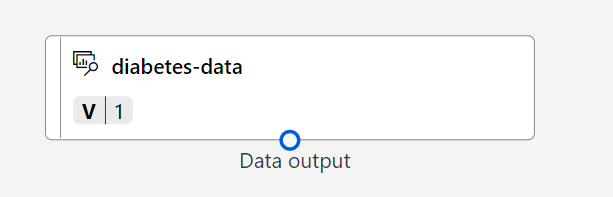

---
lab:
  title: 使用 Azure Machine Learning 設計工具探索分類
---

# 使用 Azure Machine Learning 設計工具探索分類

> **注意** 若要完成此實驗室，您需要一個具備[系統管理存取權](https://azure.microsoft.com/free?azure-portal=true)的 Azure 訂用帳戶。

## 建立 Azure Machine Learning 工作區  

1. 使用您的 Microsoft 登入資訊登入 [Azure 入口網站](https://portal.azure.com?azure-portal=true)。

1. 選取 [+ 建立資源] ，搜尋 Machine Learning，然後使用 *Azure Machine Learning* 方案建立新的 **Azure Machine Learning** 資源。 套用下列設定： 
    - **訂用帳戶**：*您的 Azure 訂用帳戶*。
    - **資源群組**：建立或選取資源群組。
    - **工作區名稱**：為您的工作區輸入唯一名稱。
    - **區域**：選取最接近的地理區域。
    - **儲存體帳戶**：留意將為您的工作區建立的預設新儲存體帳戶。
    - **金鑰保存庫**：留意將為您的工作區建立的預設新金鑰保存庫。
    - **應用程式見解**：留意將為您的工作區建立的預設新應用程式見解資源。
    - **容器登錄**：無 (*在您第一次將模型部署至容器時，系統將會自動建立一個容器登錄*)

1. 選取 [檢閱 + 建立]，然後選取 [建立]。 等候工作區建立 (可能需要幾分鐘)，然後移至已部署的資源。

1. 選取 [啟動工作室] (或開啟新的瀏覽器索引標籤，並瀏覽至 [https://ml.azure.com](https://ml.azure.com?azure-portal=true)，然後使用您的 Microsoft 帳戶登入 Azure Machine Learning 工作室)。

1. 在 Azure Machine Learning 工作室中，您應該會看到新建立的工作區。 如果不是這種情況，請在左側功能表中選取您的 Azure 目錄。 然後，從新的左側功能表中選取 [ **工作區**]，其中列出與目錄相關聯的所有工作區，然後選取您為此練習建立的工作區。

> **注意** 這是眾多利用 Azure Machine Learning 工作區的課程模組之一，包括 [Microsoft Azure AI 基本概念：探索機器學習的視覺工具](https://docs.microsoft.com/learn/paths/create-no-code-predictive-models-azure-machine-learning/)學習路徑中的其他課程模組。 如果您使用的是您個人的 Azure 訂用帳戶，請考慮建立工作區一次，然後在其他模組中重複使用該工作區。 只要您的訂用帳戶中具有 Azure Machine Learning 工作區，您的 Azure 訂用帳戶就會為了資料儲存空間向您收取少量的費用，因此我們建議當您不再需要 Azure Machine Learning 工作區時，將其刪除。

## 建立計算

1. 在[Azure Machine Learning 工作室](https://ml.azure.com?azure-portal=true)中，選取 **&#8801;** 圖示 (一個功能表圖示，其看起來像左上方三行) 堆疊，以檢視介面中的各種頁面 (您可能需要將螢幕大小最大化) 。 您可以使用左側窗格中的頁面來管理工作區中的資源。 選取 [計算] 頁面 (在 [管理] 下)。

1. 在 [計算] 頁面上，選取 [計算叢集] 索引標籤，然後使用下列設定新增計算叢集。 您將使用此計算叢集來定型機器學習模型：
    - **位置**：選取與您的工作區相同的位置。如果未列出該位置，請選擇最接近您的位置。
    - **虛擬機器層**：專用
    - **虛擬機器類型**：CPU
    - **虛擬機器大小**：
        - 選擇 [從所有選項中選取]
        - 搜尋並選取 [Standard_DS11_v2]
    - 選取 [**下一步**]
    - **計算名稱**：輸入唯一名稱。
    - **節點數量下限**：0
    - **節點數量上限**：2
    - **相應減少之前的閒置秒數**：120
    - **啟用 SSH 存取**：清除
    - 選取 [建立] 

> **注意** 計算執行個體和叢集是以標準 Azure 虛擬機器映像為基礎。 針對本課程模組，建議使用 *Standard_DS11_v2* 映像，以達到最佳的成本與效能平衡。 如果您的訂用帳戶具有不包含此映像的配額，請選擇替代映像；但請記得，較大的映像可能會產生較高的成本，而較小的映像可能不足以完成工作。 或者，請要求您的 Azure 系統管理員擴大您的配額。

建立計算叢集需要一些時間。 您可以在等待期間先移至下一個步驟。


## 建立資料集

1. 在[Azure Machine Learning 工作室](https://ml.azure.com?azure-portal=true)中，選取畫面左上方的功能表圖示，以展開左窗格。 選取 [**資產**) ] 底下的 [**資料**] 頁面 (。 [資料] 頁面具有您計劃在 Azure ML 中使用的特定資料檔案或資料表。 您也可以從此頁面建立資料集。

1. 在 [ **資料** ] 頁面的 [ **資料資產]** 索引標籤下，選取 **[+ 建立**]。 然後使用下列設定來設定資料資產：
    - **資料類型**：
        - 　　　　　　　**名稱**：diabetes-data
        - **描述**：糖尿病資料
        - **資料集類型**：表格式
    - **資料來源**：從 Web 檔案
    - **Web URL**： 
        - **Web URL**： https://aka.ms/diabetes-data
        - **略過資料驗證**：*請不要選取*
    - **設定**：
        - **檔案格式**：分隔
        - **分隔符號**：逗號
        - **編碼**：UTF-8
        - **資料行標頭**：只有第一個檔案具有標頭
        - **跳過資料列**：無
        - 　　　　　　　**資料集包含多行資料**：請勿選取
    - **結構描述**：
        - 包含 [路徑] 以外的所有欄
        - 檢閱自動偵測到的類型
    - **檢閱**
        - 選取 [建立] 

1. 建立資料集之後，請將其開啟，並檢視 [探索] 頁面，以查看資料的範例。 此資料代表患者的詳細資料，這些患者已接受糖尿病檢測。

## 在 Designer 中建立管線，並將資料載入畫布

若要開始使用 Azure Machine Learning 設計工具，您必須先建立管線，並新增您要使用的資料集。

1. 在[Azure Machine Learning 工作室](https://ml.azure.com?azure-portal=true)中，在左窗格中選取 [**撰寫**) ] 底下的 **[Designer**專案 (]，然後選取 **+** 以建立新的管線。

1. 將草稿名稱從 **Pipeline-Created-on-*date*** 變更為 **糖尿病訓練**。

1. 在專案左側的管線名稱旁邊，選取箭號圖示以展開面板 (若尚未展開的話)。 面板預設應該會開啟 [資產庫] 窗格，以面板頂端的書籍圖示表示。 請注意，可用搜尋列來尋找資產。 請留意兩個按鈕：[資料] 和 [元件]。

    

1. 選取 [資料]。 搜尋 **diabetes-data** 資料集並將其放在畫布上。

1. 以滑鼠右鍵按一下 (Ctrl+按一下 Mac) 畫布上的 **糖尿病資料** 資料集，然後選取 **[預覽資料**]。

1. 在 [設定檔] 分頁中檢閱資料的結構描述，請注意，各種資料行的分佈會以長條圖表示。

1. 向下捲動並選取 [Diabetic] (糖尿病) 資料行的資料行標頭，並注意其中有兩個值：**0** 和 **1**。 這些值代表您的模型將預測的*標籤*有兩個可能的類別，值為 **0** 時，表示患者沒有糖尿病，值為 **1** 則表示患者患有糖尿病。

1. 向上往回捲動並檢閱其他資料行，這些資料行代表將用來預測標籤的*特徵*。 請注意，這些資料行大多是數值，但每個特徵都有其本身的數值範圍。 例如，**年齡**值的範圍為 21 到 77，**DiabetesPedigree** 值的範圍則為 0.078 到 2.3016。 在定型機器學習模型時，產生的預測函式有時可能會由較大的值主導，而減少規模較小的特徵所產生的影響。 一般而言，資料科學家會藉由*正規化*數值資料行使其處於類似的規模，來緩和這種可能的偏差。

1. 關閉 **[DataOutput** ] 索引標籤，讓您可以在畫布上看到資料集，如下所示：

    

## 新增轉換

您通常必須先對資料套用一些前置處理轉換，才能將模型定型。

1. 在左側的 [ **資產庫** ] 窗格中，選取 [ **元件**]，其中包含可用於資料轉換和模型定型的各種模組。 您也可以使用搜尋列快速找到模組。

    

1. 尋找 [ **選取資料集中的資料行** ] 模組，並將它放在 **diabetes-data** 資料集下方的畫布上。 然後，將 **diabetes-data** 資料集底部的輸出連線至 [選取資料集中的資料行] 模組頂端的輸入。

1. 按兩下 [選取資料集的資料行] 模組，以存取右側的設定窗格。 選取 [編輯資料行]。 然後在 [ **選取資料行** ] 視窗中，選取 [ **依名稱** ] 和 [ **新增所有資料** 行]。 然後移除 **PatientID** ，然後按一下 [ **儲存**]。

1. 尋找 **標準化資料** 模組，並將其放在 [ **選取資料集中的資料行** ] 模組下方的畫布上。 然後，將 [選取資料集中的資料行] 模組底部的輸出連線至 [正規化資料]  模組頂端的輸入，如下所示：

    ![螢幕擷取畫面：資料集已連線至 [正規化資料] 模組的管道。](media/create-classification-model/dataset-normalize.png)

1. 按兩下 [正規化資料] 模組以檢視其設定。請注意，您必須指定轉換方法和要進行轉換的資料行。

1. 將 [轉換方法] 設定為 **MinMax**，並將 [檢查時常數資料行使用 0] 設定為 **True**。 使用 **[編輯**資料行] 編輯要轉換的資料行。 選取 **[使用規則** 的資料行]，然後複製下列清單，並貼到 [包含資料行名稱] 底下：  

```
Pregnancies, PlasmaGlucose, DiastolicBloodPressure, TricepsThickness, SerumInsulin, BMI, DiabetesPedigree, Age
```


按一下 [ **儲存** ] 並關閉選取方塊。

資料轉換會將數值資料行正規化，使其處於相同的規模，這應該有助於防止具有大數值的資料行主導模型定型。 您通常會套用如同此作業一般的一系列前置處理轉換，為您的資料進行定型的準備，但在本練習中，我們會將內容簡化。

## 執行管線

若要套用資料轉換，您必須以實驗形式執行管線。

1. 選取頁面頂端的 [ **設定 & 提交** ]，以開啟 [ **設定管線作業** ] 對話方塊。

1. 在 [ **基本]** 頁面上，選取 [ **新建** ]，並將實驗名稱設定為 **mslearn-diabetes-training** ，然後選取 [ **下一步** ]。

1. 在 [ **輸入 & 輸出** ] 頁面上，選取 [ **下一步** ] 而不進行任何變更。

1. 在 [ **執行時間設定** ] 頁面上，出現錯誤，因為您沒有執行管線的預設計算。 在 [ **選取計算類型** ] 下拉式清單中選取 [ *計算叢集* ]，然後在 [ **選取 Azure ML 計算叢集** ] 下拉式清單中選取您最近建立的計算叢集。

1. 選取 **[檢閱 + 提交** ] 以檢閱管線作業，然後選取 [ **提交** ] 以執行定型管線。

1. 請等候幾分鐘，讓流程執行完成。 您可以選取 [**資產**] 底下的 [**作業**]，以檢查作業的狀態。 從該處選取 **mslearn-diabetes-training** 實驗，然後選取 **[糖尿病訓練** ] 作業。

## 檢視轉換的資料

當執行完成時，資料集現在已準備好進行模型定型。

1. 以滑鼠右鍵按一下 (Ctrl+按一下 Mac) 畫布上的 **[標準化資料** ] 模組，然後選取 [ **預覽資料**]。 選取 [轉換的資料集]。

1. 檢視資料，並請注意，您選取的數值資料行已正規化為一般規模。

1. 關閉正規化資料的結果視覺效果。 返回上一個索引標籤。

使用資料轉換準備資料之後，即可使用此資料來定型機器學習模型。

## 新增定型模組

常見做法是使用資料的子集來定型模型，同時保留一些資料用以測試定型的模型。 這可讓您將模型所預測的標籤與原始資料集中實際的已知標籤進行比較。

在本練習中，您將遵循步驟來擴充 **Diabetes Training** 管線，如下所示：


請遵循以下的步驟，在新增及設定必要的模組時參考上文中的圖片。

1. 返回 **[Designer**] 頁面，然後選取 **[糖尿病訓練**] 管線。

1. 在左側 [資產庫] 窗格的 [元件]  中，搜尋**分割資料**模組，並放在畫布上的 [正規化資料] 模組下方。 然後，將 [正規化資料] 模組的 [轉換的資料集] 輸出 (左側) 連線至 [分割資料] 模組的輸入。

    >**提示** 使用搜尋列來快速找到模組。

1. 選取 [分割資料] 模組，然後設定其設定，如下所示：
    - **分割模式**：分割資料列
    - **第一個輸出資料集中的資料列比例**：0.7
    - **隨機分割**：True
    - **隨機種子**：123
    - **分層的分割**：否

1. 在 [資產庫] 中，搜尋**定型模型**模組，並放在畫布上的 [分割資料] 模組下方。 然後，將 [分割資料] 模組的 [結果資料集 1] (左側) 輸出，連線至 [定型模型] 模組的 [資料集] (右側) 輸入。

1. 我們要定型的模型會預測 [糖尿病] 值，因此請選取 [定型模型] 模組並修改其設定，將 [標籤資料行] 設為 [糖尿病] 。

    模型將預測的 [糖尿病] 標籤是類別 (0 或 1)，因此我們必須使用*分類*演算法來定型模型。 具體而言，有兩種可能的類別，因此我們需要使用*二元分類*演算法。

1. 在 [資產庫] 中，搜尋**二元羅吉斯迴歸**模組，並放在畫布上的 [分割資料] 模組左側和 [定型模型] 模組上方。 然後，將該模組地輸出連線至 [定型模型] 模組的 [未定型模型]  (左側) 輸入。

   若要測試已定型的模型，則必須用此模型來*評分*分割原始資料時所保留的驗證資料集，也就是預測驗證資料集中的特徵標籤。

1. 在 [資產庫] 中，搜尋**評分模型**模組並置在畫布上的 [定型模組] 模組下方。 然後，將 [定型模型] 模組的輸出連線至 [評分模型] 模組的 [定型模型]  (左側) 輸入，並將 [分割資料] 模組的 [結果資料集 2]  (右側) 輸出連線至 [評分模型] 模組的 [資料集]  (右側) 輸入。

## 執行訓練管線

現在您已準備就緒，可執行訓練管線並定型模型。

1. 選取 [ **設定 & 提交**]，然後使用名為 **mslearn-diabetes-training**的現有實驗來執行管線。

1. 等待實驗執行完畢。 這項作業可能需要 5 分鐘或更久的時間。

1. 選取 [**資產**] 底下的 [**作業**]，以檢查作業的狀態。 從該處選取 **mslearn-diabetes-training** 實驗，然後選取最新的 **糖尿病訓練** 作業。

1. 在新索引標籤上，以滑鼠右鍵按一下 [mac] (Ctrl+) 按一下畫布上的 **[評分模型]** 模組，選取 [ **預覽資料** ]，然後選取 [ **評分資料集** ] 來檢視結果。

1. 向右捲動，並注意 [糖尿病] 資料行 (其中包含已知的實際標籤值) 旁有一個名為 [評分標籤] 的新資料行 (包含預測的標籤值)，和一個 [評分機率] 資料行 (其中包含 0 與 1 之間的機率值)。 這表示*陽性*預測的機率，因此，大於 0.5 的機率會產生預測標籤 ***1*** (糖尿病)，而 0 與 0.5 之間的機率則會產生預測標籤 ***0*** (非糖尿病)。

1. 關閉 **[Scored_dataset** ] 索引標籤。

模型正在預測 [糖尿病] 標籤的值，但預測的可靠性如何？ 您必須評估該模型才能評估可靠性。

您保留並用於對模型進行評分的驗證資料，包含標籤的已知值。 因此，若要驗證模型，您可以比較標籤的實際值與您為驗證資料集評分時所預測的標籤值。 根據這項比較，您可以計算各種計量，其中說明模型的執行效能。

## 新增評估模型模組

1. 返回**Designer，** 然後開啟您所建立的**Diabetes Training**管線。

1. 在 [資產庫] 中，搜尋**評估模型**模組並放在畫布上的 [評分模型] 模組下方，然後將 [評分模型] 模組的輸出連線至 [評估模型] 模組的 [評分的資料集] (左側) 輸入。

1. 請確認您的管線如下所示：

    

1. 選取 [ **設定 & 提交**]，然後使用名為 **mslearn-diabetes-training**的現有實驗來執行管線。

1. 等待實驗執行完畢。

1. 選取 [**資產**] 底下的 [**作業**]，以檢查作業的狀態。 從該處選取 **mslearn-diabetes-training** 實驗，然後選取最新的 **糖尿病訓練** 作業。

1. 在新索引標籤上，以滑鼠右鍵按一下 (Ctrl+按一下 Mac，) 畫布上的 **[評估模型]** 模組，選取 [ **預覽資料** ]，然後選取 [ **評估結果** ] 以檢視效能計量。 這些計量可協助資料科學家評估模型根據驗證資料進行預測的效能。

1. 向下捲動以檢視該模型的*混淆矩陣*。 觀察每個可能類別的預測和實際值計數。 

1. 檢閱位於混淆矩陣左側的計量，其中包括：
    - **正確性**：換句話說，模型正確預測糖尿病的比例為何？
    - **精確度**：換句話說，從*模型預測*為患有糖尿病的所有病患中，模型預測正確次數的百分比。 
    - **召回率**：換句話說，在「實際有」糖尿病的所有患者中，模型識別出幾個糖尿病案例？
    - **F1 分數**

1. 使用位於計量清單上方的 [閾值] 滑桿。 請嘗試移動閾值滑桿並觀察這對混淆矩陣有何影響。 如果您將閾值滑桿往左移到底 (0)，[召回率] 計量將會變成 1，如果將其往右移到底 (1)，則 [召回率] 計量會變成 0。

1. 查看 **ROC 曲線** 的閾值滑桿和與下方其他計量一起列出的 **AUC** 計量。 若要了解此區域如何表示模型的效能，請設想從 ROC 圖表左下方到右上方的對角直線。 這條對角直線表示您憑藉猜測或擲硬幣來決定患者數時的預期效能 - 您可以預期大約一半正確，一半錯誤，因此，對角線下方的區域表示 AUC 為 0.5。 如果模型的 AUC 高於二元分類模型，則表示該模型的執行效能優於隨機猜測。

1. 關閉 **[Evaluation_results** ] 索引標籤。

此模型的效能不盡理想，部分原因是我們僅執行了最低限度的特徵工程和前置處理。 您可以嘗試不同的分類演算法 (例如**二級決策樹系**)，並比較該結果。 您可以將 [分割資料] 模組的輸出連線至多個 [定型模型] 和 [評分模型] 模組，也可以再將另一個 [評分模型] 模組連線至 [評估模型] 模組，以兩相比較。 本練習的重點是為您介紹分類和 Azure Machine Learning 設計工具介面，而不是定型完美的模型！

## 建立推斷管線

1. 找出畫布上方的功能表，然後選取 **[建立推斷管線**]。 您可能需要將畫面展開為全螢幕，並按一下畫面右上角的三個點圖示 [...] ，以在功能表中找到 [建立推斷管線]。  

    ![螢幕擷取畫面顯示 [建立推斷管線] 的位置。](media/create-classification-model/create-inference-pipeline.png)

1. 在 [ **建立推斷管線** ] 下拉式清單中，選取 **[即時推斷管線**]。 幾秒鐘後，就會開啟名為 **Diabetes Training-real time inference** 的新版管線。

1. 將新管線重新命名為 **Predict Diabetes**，然後檢閱新的管線。 某些轉換和定型步驟是此管線的一部分。 定型的模型將用於評分新資料。 管線也包含 Web 服務輸出來傳回結果。

    您要對推斷管線進行下列變更：

    

    - 針對要提交的新資料，新增 **Web 服務輸入**元件。
    - 將 **diabetes-data** 資料集取代為 [手動輸入資料] 模組，其中未包含標籤資料行 (**糖尿病**)。
    - 編輯 [選取資料集中的資料行] 模組中選取的資料行。
    - 移除 [評估模型] 模組。
    - 在 Web 服務輸出前面插入 [執行 Python 指令碼] 模組，而僅傳回患者識別碼、預測的標籤值及機率。

1. 針對從自訂資料集建立的模型，管線不會自動包含 **Web 服務輸入**元件。 從資產庫搜尋 **Web 服務輸入**元件，並放在管線頂端。 將 **Web 服務輸入** 元件的輸出連接到畫布上已經位於畫布 **上的 [選取資料集中的資料** 行] 元件。

1. 推斷管線假設新資料會符合原始定型資料的結構描述，因此會包含來自訓練管線的 **diabetes-data** 資料集。 不過，此輸入資料包含模型所預測的 [糖尿病] 標籤，而不會納入尚未進行糖尿病預測的新患者資料。 請刪除此模組，並取代為 [手動輸入資料] 模組，其中下列 CSV 資料所含的三個新患者觀測值特徵值未附有標籤：

    ```CSV
    PatientID,Pregnancies,PlasmaGlucose,DiastolicBloodPressure,TricepsThickness,SerumInsulin,BMI,DiabetesPedigree,Age
    1882185,9,104,51,7,24,27.36983156,1.350472047,43
    1662484,6,73,61,35,24,18.74367404,1.074147566,75
    1228510,4,115,50,29,243,34.69215364,0.741159926,59
    ```

1. 將新的 **[手動輸入資料**] 模組連接到與**Web 服務輸入**相同的 [**選取資料集中的資料行] 模組的資料集**輸入。** **

1. 編輯 [選取資料集中的資料行] 模組。 從「選取的資料行」中移除**糖尿病**。

1. 推斷管線納入的 [評估模型] 模組並不適用於新資料預測，因此請刪除此模組。

1. [評分模型] 模組的輸出包含所有輸入特徵，以及預測的標籤和機率分數。 若要將輸出限定於預測和機率：
    - 刪除 [評分模型] 模組與 [Web 服務輸出] 之間的連線。
    - 新增 [執行 Python 指令碼] 模組，使用下列程式碼取代所有預設 Python 指令碼 (這只會選取 [PatientID]、[評分標籤] 及 [評分機率] 資料行，並加以適當重新命名)：

    ```Python
    import pandas as pd
    
    def azureml_main(dataframe1 = None, dataframe2 = None):
    
        scored_results = dataframe1[['Scored Labels', 'Scored Probabilities']]
        scored_results.rename(columns={'Scored Labels':'DiabetesPrediction',
                                    'Scored Probabilities':'Probability'},
                            inplace=True)
        return scored_results
    ```

1. 將 **評分模型** 模組的輸出連接到 *資料集1* ， (**執行 Python 腳本**的最左邊) 輸入，並將 *結果資料集* (將 **執行 Python 腳本** 模組的左側) **輸出連接到 Web 服務輸出**。

1. 請確認您的管線看起來類似下列圖片：

    

1. 以名為 **mslearn-diabetes-inference** 的全新實驗，對您的計算叢集執行管線。 該實驗可能需要一段時間執行。

1. 返回 [  **作業] 索引** 標籤。從該處選取 **mslearn-diabetes-inference** 實驗，然後選取 **[預測糖尿病** ] 作業。

1. 當管線完成時，請選取 [ **執行 Python 腳本** ] 模組。 選取 [預覽資料]，並選取 [結果資料集]，以查看輸入資料中三個病患觀察值的預測標籤和機率。

您的推斷管線會根據患者的特徵，預測患者是否具有罹患糖尿病的風險。 現在您已可發佈管線，供用戶端應用程式使用。

在您建立並測試用於即時推斷的推斷管線之後，您可以將該管線發佈為服務，供用戶端應用程式使用。

> **注意** 在此練習中，您會將 Web 服務部署至 Azure 容器執行個體 (ACI)。 此類型的計算是動態建立的，而且適用於開發及測試。 針對生產環境，您應該建立*推斷叢集*，該叢集可提供更佳可擴縮性與安全性的 Azure Kubernetes Service (AKS) 叢集。

## 部署服務

1. 在 [ **預測糖尿病** ] 作業視窗頂端，選取 [ **部署**]。

    

1. 在 **[設定即時端點]** 中，選取 **[部署新的即時端點** ]，並使用下列設定：
    - **名稱**：predict-diabetes
    - **描述**：糖尿病分類
    - **計算類型**：Azure 容器執行個體

1. 選取 **[部署** 並等候 Web 服務部署- 這可能需要幾分鐘的時間。

## 測試服務

1. 在 [端點] 頁面中，開啟 [predict-diabetes] 即時端點。

    ![左側窗格 [端點] 選項位置的螢幕擷取畫面。](media/create-classification-model/endpoints-screenshot.png)

1. **predict-diabetes** 端點開啟時，請選取 [測試] 索引標籤，我們稍後將用於測試模型與新資料。 刪除 [輸入資料以測試即時端點] 下的目前資料。 複製下列資料並貼至資料區段：  

    ```JSON
    {
      "Inputs": {
        "input1":
          [
            { "PatientID": 1882185,
              "Pregnancies": 9,
              "PlasmaGlucose": 104,
              "DiastolicBloodPressure": 51,
              "TricepsThickness": 7,
              "SerumInsulin": 24,
              "BMI": 27.36983156,
              "DiabetesPedigree": 1.3504720469999998,
              "Age": 43 }
            ]
          },
      "GlobalParameters":  {}
    }
    ```

    > **注意** 上述 JSON 定義患者的特徵，並使用您所建立的 **predict-diabetes** 服務來預測糖尿病診斷。

1. 選取 [測試]。 在畫面右側，應可看到下列輸出 **'DiabetesPrediction'**。 若預測患者患有糖尿病，輸出為 1；若預測患者沒有糖尿病，則為 0。  

    

    您已測試使用 [取用] 索引標籤中的認證、可供連線至用戶端應用程式的服務。實驗室到此結束。 歡迎繼續使用您剛才部署的服務進行更多試驗。

## 清除

您建立的 Web 服務會裝載在 *Azure 容器執行個體*中。 如果您不打算進一步試驗此服務，則應刪除端點，以避免產生不必要的 Azure 使用量。 您也應該刪除計算叢集。

1. 在 [Azure Machine Learning 工作室](https://ml.azure.com?azure-portal=true)的 [端點] 索引標籤上，選取 **predict-diabetes** 端點。 然後，選取 [刪除] ，並確認您想要刪除該端點。

1. 在 [計算] 頁面的 [計算叢集]  索引標籤上，選取計算叢集，然後選取 [刪除]。

>**注意** 刪除計算可確保您的訂用帳戶不會支付計算資源的費用。 不過，只要您的訂用帳戶中具有 Azure Machine Learning 工作區，您就必須為了資料儲存空間支付少許的費用。 如果您已完成探索 Azure Machine Learning，則可刪除 Azure Machine Learning 工作區及其相關的資源。 但是，如果您打算完成本系列中的任何其他實驗室，您將需要重新建立 Azure Machine Learning 工作區。
>
> 若要刪除您的工作區：
>
> 1. 在 [Azure 入口網站](https://portal.azure.com?azure-portal=true)的 [資源群組] 頁面中，開啟您在建立 Azure Machine Learning 工作區時所指定的資源群組。
> 1. 按一下 [刪除資源群組]、輸入資源群組名稱以確認要刪除，然後選取 [刪除]。
