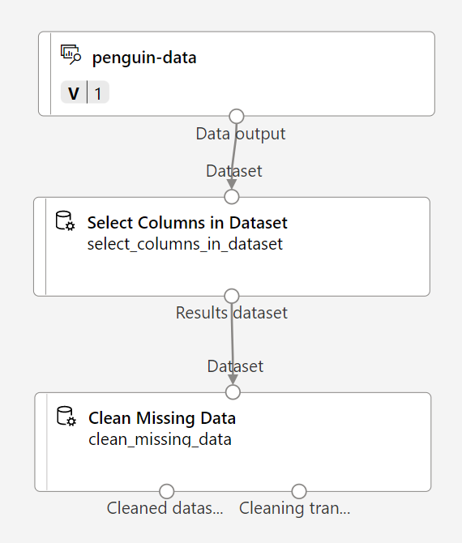

---
lab:
  title: 使用 Azure Machine Learning 設計工具探索叢集
---

# 使用 Azure Machine Learning 設計工具探索叢集

> **注意** 若要完成此實驗室，您需要一個具備[系統管理存取權](https://azure.microsoft.com/free?azure-portal=true)的 Azure 訂用帳戶。

## 建立 Azure Machine Learning 工作區  

1. 使用您的 Microsoft 登入資訊登入 [Azure 入口網站](https://portal.azure.com?azure-portal=true)。

1. 選取 [+ 建立資源] ，搜尋 Machine Learning，然後使用 *Azure Machine Learning* 方案建立新的 **Azure Machine Learning** 資源。 套用下列設定： 
    - **訂用帳戶**：*您的 Azure 訂用帳戶*。
    - **資源群組**：建立或選取資源群組。
    - **工作區名稱**：為您的工作區輸入唯一名稱。
    - **區域**：選取最接近的地理區域。
    - **儲存體帳戶**：留意將為您的工作區建立的預設新儲存體帳戶。
    - **金鑰保存庫**：留意將為您的工作區建立的預設新金鑰保存庫。
    - **應用程式見解**：留意將為您的工作區建立的預設新應用程式見解資源。
    - **容器登錄**：無 (*在您第一次將模型部署至容器時，系統將會自動建立一個容器登錄*)

1. 選取 [檢閱 + 建立]，然後選取 [建立]。 等候工作區建立 (可能需要幾分鐘)，然後移至已部署的資源。

1. 選取 [啟動工作室] (或開啟新的瀏覽器索引標籤，並瀏覽至 [https://ml.azure.com](https://ml.azure.com?azure-portal=true)，然後使用您的 Microsoft 帳戶登入 Azure Machine Learning 工作室)。

1. 在 Azure Machine Learning 工作室中，您應該會看到新建立的工作區。 如果不是這種情況，請在左側功能表中選取您的 Azure 目錄。 然後，從新的左側功能表中選取 [ **工作區**]，其中列出與目錄相關聯的所有工作區，然後選取您為此練習建立的工作區。

> **注意** 這是眾多利用 Azure Machine Learning 工作區的課程模組之一，包括 [Microsoft Azure AI 基本概念：探索機器學習的視覺工具](https://docs.microsoft.com/learn/paths/create-no-code-predictive-models-azure-machine-learning/)學習路徑中的其他課程模組。 如果您使用的是您個人的 Azure 訂用帳戶，請考慮建立工作區一次，然後在其他模組中重複使用該工作區。 只要您的訂用帳戶中具有 Azure Machine Learning 工作區，您的 Azure 訂用帳戶就會為了資料儲存空間向您收取少量的費用，因此我們建議當您不再需要 Azure Machine Learning 工作區時，將其刪除。

## 建立計算

1. 在[Azure Machine Learning 工作室](https://ml.azure.com?azure-portal=true)中，選取 **&#8801;** 圖示 (一個功能表圖示，其看起來像左上方三行) 堆疊，以檢視介面中的各種頁面 (您可能需要將螢幕大小最大化) 。 您可以使用左側窗格中的頁面來管理工作區中的資源。 選取 [計算] 頁面 (在 [管理] 下)。

2. 在 [計算] 頁面上，選取 [計算叢集] 索引標籤，然後使用下列設定新增計算叢集。 您將使用此計算叢集來定型機器學習模型：
    - **位置**：選取與您的工作區相同的位置。如果未列出該位置，請選擇最接近您的位置。
    - **虛擬機器層**：專用
    - **虛擬機器類型**：CPU
    - **虛擬機器大小**：
        - 選擇 [從所有選項中選取]
        - 搜尋並選取 [Standard_DS11_v2]
    - 選取 [**下一步**]
    - **計算名稱**：輸入唯一名稱。
    - **節點數量下限**：0
    - **節點數量上限**：2
    - **相應減少之前的閒置秒數**：120
    - **啟用 SSH 存取**：清除
    - 選取 [建立] 

> **注意** 計算執行個體和叢集是以標準 Azure 虛擬機器映像為基礎。 針對本課程模組，建議使用 *Standard_DS11_v2* 映像，以達到最佳的成本與效能平衡。 如果您的訂用帳戶具有不包含此映像的配額，請選擇替代映像；但請記得，較大的映像可能會產生較高的成本，而較小的映像可能不足以完成工作。 或者，請要求您的 Azure 系統管理員擴大您的配額。

建立計算叢集需要一些時間。 您可以在等待期間先移至下一個步驟。

## 建立管線並新增資料集

若要開始使用 Azure Machine Learning 設計工具，您必須先建立管線。

1. 在[Azure Machine Learning 工作室](https://ml.azure.com?azure-portal=true)中，選取畫面左上方的功能表圖示，以展開左窗格。 在 [**撰寫**) ] 底下檢視 **[Designer]** 頁面 (，然後選取 **+** 以建立新的管線。

1. 將草稿名稱 (**Pipeline-Created-on-date*？) 變更為 **定型 Penguin 叢集**。

    在 Azure Machine Learning 中，模型定型和其他作業的資料通常會封裝在名為*資料集*的物件中。 在本課程模組中，您將使用包含三個企鵝物種觀察記錄的資料集。

1. 檢視 [資產] 底下的 [資料] 頁面。 [資料] 頁面具有您計劃在 Azure ML 中使用的特定資料檔案或資料表。

1. 在 [ **資料** ] 頁面的 [ **資料資產]** 索引標籤下，選取 **[+ 建立**]。 然後使用下列設定來設定資料資產：
    - **資料類型**：
        - **名稱**：penguin-data
        - **描述**：Penguin 資料
        - **資料集類型**：表格式
    - **資料來源**：從 Web 檔案
    - **Web URL**： 
        - **Web URL**： https://aka.ms/penguin-data
        - **略過資料驗證**：*請不要選取*
    - **設定**：
        - **檔案格式**：分隔
        - **分隔符號**：逗號
        - **編碼**：UTF-8
        - **資料行標頭**：只有第一個檔案具有標頭
        - **跳過資料列**：無
        - 　　　　　　　**資料集包含多行資料**：請勿選取
    - **結構描述**：
        - 包含 [路徑] 以外的所有欄
        - 檢閱自動偵測到的類型
    - **檢閱**
        - 選取 [建立] 

1. 建立資料集之後，請將其開啟，並檢視 [探索] 頁面，以查看資料的範例。 此資料代表下列項目的測量：鳥嘴長度和深度、鰭肢長度，以及多次觀察後企鵝的身體質量。 資料集中表示三個企鵝物種：*Adelie*、*Gentoo* 和 *Chinstrap*。

> **注意** 此練習中使用的企鵝資料集是由 [Dr. Kristen Gorman](https://www.uaf.edu/cfos/people/faculty/detail/kristen-gorman.php) 和 [Palmer Station, Antarctica LTER](https://pal.lternet.edu/) ([Long Term Ecological Research Network](https://lternet.edu/) 的成員) 所收集並提供的資料子集。

### 將資料載入畫布

1. 選取左側功能表上的 [設計工具]，以返回您的管線。 在 **[Designer]** 頁面上，選取 **[定型 Penguin 叢集**管線草稿]。

1. 在左側的管線名稱旁邊，選取箭號圖示以展開面板 (若尚未展開的話)。 面板預設應該會開啟 [資產庫] 窗格，以面板頂端的書籍圖示表示。 請注意，可用搜尋列來尋找資產。 請留意兩個按鈕：[資料] 和 [元件]。

    

1. 選取 **[資料**]，搜尋並將 **penguin-data** 資料集放在畫布上。

1. 以滑鼠右鍵按一下 (在 Mac 上，則是按住 Ctrl 並按一下) 畫布上的 **penguin-data** 資料集，然按一下 [預覽資料]。

1. 選取 [ *設定檔] 索引* 標籤，指出您可以將各種資料行的分佈視為長條圖。

1. 請注意資料集的下列特性：

    - 資料集包含下列資料行： 
        - **CulmenLength**：企鵝嘴的長度 (以毫米為單位)。
        - **CulmenDepth**：企鵝嘴的深度 (以毫米為單位)。
        - **FlipperLength**：企鵝鰭肢的長度 (以毫米為單位)。
        - **BodyMass**：企鵝重量 (以克為單位)。
        - **物種**：物種指標 (0:"Adelie"、1:"Gentoo"、2:"Chinstrap")
    - **CulmenLength** 資料行中有兩個遺漏值 (**CulmenDepth**、**FlipperLength** 和 **BodyMass** 資料行也有兩個遺漏值)。
    - 度量值的規模不同 (從數十毫米到數千克)。

1. 關閉 **DataOutput** 頁面，讓您可以在管線畫布上看到資料集。

## 套用轉換

1. 在左側的 [ **資產庫]** 窗格中，選取 [ **元件** (，其中包含可用於資料轉換和模型定型) 的各種模組。 您也可以使用搜尋列快速找到模組。

    

1. 為了將企鵝觀察叢集化，我們只會使用度量 - 將忽略物種資料行。 因此，搜尋 [選取資料集中的資料行] 模組，並將其放在 **penguin-data** 模組下的畫布上，然後將 **penguin-data** 模組底部的輸出連線到 [選取資料集中的資料行] 模組頂端的輸入，如下所示：

    ![螢幕擷取畫面：連線到 [選取資料集中的資料行] 模組的 penguin-data 資料集。](media/create-clustering-model/dataset-select-columns.png)

1. 按兩下 [選取資料集中的資料行] 模組，然後在右側的窗格中，選取 [編輯資料行]。 然後在 [選取資料行] 視窗中，選取 [依名稱]，並使用 **+** 連結來選取資料行名稱 **CulmenLength**、**CulmenDepth**、**FlipperLength** 和 **BodyMass**；如下所示：

    

1. 選取 [ **儲存**]，然後關閉 [ **選取資料集中的資料行]** 功能表，以返回設計工具畫布。

1. 在 **[資產庫**] 中，搜尋 **清除遺漏的資料** 模組，並將其放在畫布上，然後在 [ **選取資料集中的資料** 行] 模組下方，將它們連線如下：

    

1. 按兩下 **[清除遺漏資料** ] 模組，然後在右側的 [設定] 窗格中，選取 [ **編輯資料行**]。 然後在 [要清除的資料行] 視窗中，選取 [套用規則] 並包括 [所有資料行]；如下所示：

    ![螢幕擷取畫面：顯示如何使用 [套用規則] 選項來選取所有資料行。](media/create-clustering-model/normalize-columns.png)

1. 選取 **[儲存** ]，然後在 [設定] 窗格中設定下列組態設定：
    - **最小遺漏值比率**：0.0
    - **最大遺漏值比率**：1.0
    - **移除模式**：移除整個資料列

1. 在 [資產庫] 中，搜尋 [正規化資料] 模組，並將其放在 [清除遺漏資料] 模組下的畫布上。 然後將 [清除遺漏資料] 模組最左邊的輸出連線到 [正規化資料] 模組的輸入。

    ![螢幕擷取畫面：連線到 [正規化資料] 模組的 [清除遺漏資料] 模組。](media/create-clustering-model/dataset-normalize.png)

1. 按兩下 [正規化資料] 模組，然後在右側的窗格中，將 [轉換方法] 設定為 [MinMax] 並選取 [編輯資料行]。 然後在 [要轉換的資料行] 視窗中，選取 [套用規則] 並包括 [所有資料行]；如下所示：

    

1. 選取 **[儲存** ]，然後關閉 **[正規化資料** ] 模組設定以返回設計工具畫布。

## 執行管線

若要套用資料轉換，您必須以實驗形式執行管線。

1. 選取頁面頂端的 **[設定 & 提交** ]，以開啟 [ **設定管線作業** ] 對話方塊。

1. 在 [ **基本]** 頁面上，選取 [ **新建** ]，並將實驗的名稱設定為 **mslearn-penguin-training** ，然後選取 [ **下一步** ]。

1. 在 [ **輸入 & 輸出]** 頁面上，選取 [ **下一步** ] 而不進行任何變更。

1. 在 [ **執行時間設定** ] 頁面上，出現錯誤，因為您沒有執行管線的預設計算。 在 [ **選取計算類型** ] 下拉式清單中，選取 [ *計算叢集* ]，然後在 [ **選取 Azure ML 計算叢集** ] 下拉式清單中選取您最近建立的計算叢集。

1. 選取 **[下一步** ] 以檢閱管線作業，然後選取 [ **提交** ] 以執行定型管線。

1. 等待執行完畢。 這項作業可能需要 5 分鐘或更久的時間。 您可以選取 **[資產**] 底下的 [**作業**] 來檢查作業的狀態。 從該處選取 **[定型 Penguin 叢集** 作業]。


## 檢視轉換的資料

1. 執行完成時，模組看起來會像這樣：

    

1. 以滑鼠右鍵按一下 **[標準化資料** ] 模組，選取 [ **預覽資料**]，然後選取 [ **已轉換的資料集** ] 以檢視結果。

1. 檢視資料，請注意，已移除 [物種] 資料行、沒有遺漏值，而且所有四個特徵的值已正規化為一般規模。

1. 關閉 **Transformed_dataset** 頁面以返回管線執行。

既然您已選取並準備好要從資料集使用的特徵，您就可以使用這些特徵來定型叢集模型。

使用資料轉換準備資料之後，即可使用此資料來定型機器學習模型。

## 新增定型模組

逐步執行下列步驟來擴充 **Train Penguin Clustering** 管線，如下所示：

![螢幕擷取畫面：K-Means 叢集演算法元件與 [指派資料給模組] 元件。](media/create-clustering-model/k-means.png)

請遵循以下的步驟，在新增及設定必要的模組時參考上文中的影像。

1. 返回 **[Designer]** 頁面，然後開啟 **[定型 Penguin 叢集**管線草稿]。

1. 在左側 [資產庫] 窗格中，搜尋**分割資料**模組，並放在畫布上的 [正規化資料] 模組下方。 然後將 [正規化資料] 模組的左側輸出連線至 [分割資料] 模組的輸入。

    >**提示** 使用搜尋列來快速找到模組。

1. 選取 [分割資料] 模組，然後設定其設定，如下所示：
    - **分割模式**：分割資料列
    - **第一個輸出資料集中的資料列比例**：0.7
    - **隨機分割**：True
    - **隨機種子**：123
    - **分層的分割**：否

1. 在 [資產庫] 中，搜尋**定型叢集模型**模組，並將其放置於畫布的 [分割資料] 模組底下。 然後，將 [分割資料] 模組的 [結果資料集 1] (左側) 輸出，連線至 [定型叢集模型] 模組的 [資料集] (右側) 輸入。

1. 叢集模型應該使用您從原始資料集選取的所有功能，將叢集指派給資料項目。 按兩下 [定型叢集模型] 模組，然後在右側窗格中選取 [編輯資料行]。 使用 [套用規則] 選項來包含所有資料行，例如：

    

1. 我們所定型的模型會使用這些功能將資料分組成叢集，因此我們需要使用「叢集」 演算法來定型模型。 在 **[資產庫**] 中，搜尋 **K-Means 叢集模組，並將 K-Means 叢集** 模組放在畫布上、 **分割資料** 模組左邊，以及定型 **叢集模型** 模組上方。 然後將其輸出連線至 [定型叢集模型] 模組的 [未定型模型] (左側) 輸入。

1. K-Means 演算法會將項目分組為您指定的叢集數目 - 稱為 ***K*** 的值。選取 [K-Means 叢集] 模組，並在右側窗格中，將 [距心數目] 參數設為 **3**。

    > **注意** 您可以將資料觀察值 (例如企鵝度量) 視為多維度向量。 K-Means 演算法的運作方式如下：
    > 1. 在 *n* 維空間 (其中 *n* 是特徵向量中的維度數目) 中，將 *K* 座標初始化為隨機選取的點，稱為「距心」。
    > 2. 將特徵向量繪製為相同空間中的點，並將每個點指派給其最接近的距心。
    > 3. 將距心移至配置給其的點中間 (根據「平均」 距離)。
    > 4. 移動之後，將這些點重新指派給其最接近的距心。
    > 5. 重複步驟 c。 和 d。 直到叢集配置穩定或指定的反復專案數目已完成為止。

   在使用 70% 資料來定型叢集模型之後，您可以使用剩餘的 30% 來進行測試，方法是使用模型將資料指派給叢集。

1. 在 [資產庫] 中，搜尋 [將資料指派給叢集] 模組並將其拖曳至畫布，放在 [定型叢集模型] 模組下方。 然後將 [定型叢集模型] 模組的 [定型模型] (左側) 輸出連線至 [將資料指派給叢集]模組的 [定型模型] (左側) 輸入，並將 [分割資料] 模組的 [結果資料集 2] (右側) 輸出連線至 [將資料指派給叢集] 模組的 [資料集] (右側) 輸入。

## 執行訓練管線

現在您已準備就緒，可執行訓練管線並定型模型。

1. 請確定您的管線看起來像這樣：

    ![螢幕擷取畫面：完整的定型管線，從企鵝資料開始並以 [指派資料給叢集] 元件結束。](media/create-clustering-model/k-means.png)

1. 選取 **[設定 & 提交**]，然後在計算叢集上使用名為 **mslearn-penguin-training** 的現有實驗來執行管線。

1. 等待執行完畢。 這項作業可能需要 5 分鐘或更久的時間。 選取 **[資產**] 底下的 [**作業**] 來檢查作業的狀態。 從該處選取最新的 **訓練 Penguin 叢集** 作業。

1. 實驗執行完成後，以滑鼠右鍵按一下 [ **將資料指派給叢集** ] 模組，選取 [ **預覽資料** ]，然後選取 [ **結果資料集** ] 以檢視結果。

1. 向下捲動，並記下 [指派] 資料行，其中包含每個資料列獲指派的叢集 (0、1 或 2)。 另外還有新的資料行，指出從表示此資料列的點到每個叢集中心的距離 - 最接近該點的叢集就是獲指派的叢集。

1. 關閉 **Results_dataset** 視覺效果以返回管線執行。

模型正在預測企鵝觀察的叢集，但其預測的可靠程度如何？ 您必須評估模型才能評估可靠性。

評估叢集模型難以進行，因為叢集指派沒有先前已知的 *true* 值。 成功的叢集模型就是在每個叢集中項目之間實現良好分隔層級的叢集模型，因此我們需要計量來協助我們測量該區隔。

## 新增評估模型模組

1. 在 **[Designer]** 頁面上，開啟 **[定型 Penguin 叢集**管線草稿]。

1. 在 [資產庫] 中，在畫布的 [將資料指派給叢集] 模組底下，搜尋並放置 [評估模型] 模組。 將 [將資料指派給叢集] 模組的輸出連結至 [評估模型] 模組的 [計分的資料集] \(左側\) 輸入。

1. 請確定您的管線看起來像這樣：

    ![螢幕擷取畫面：如何將 [評估模型] 模組新增至 [指派資料給叢集] 模組。](media/create-clustering-model/evaluate-cluster.png)

1. 選取 **[設定 & 提交**]，然後在計算叢集上使用名為 **mslearn-penguin-training** 的現有實驗來執行管線。

1. 等待實驗執行完畢。 若要檢查其狀態，請移至 [ **作業** ] 頁面，然後選取最新的 **訓練 Penguin 叢集** 作業。

1. 以滑鼠右鍵按一下 **[評估模型]** 模組，選取 **[預覽資料**]，然後選取 [ **評估結果**]。 檢閱每個資料列中的計量：
    - **與其他中心的平均距離**
    - **與叢集中心的平均距離**
    - **點數目**
    - **與叢集中心的最大距離**

1. 關閉 **[Evaluation_results] 索引** 標籤。

既然您有一個運作中的叢集模型，就可以使用該模型，將新的資料指派給「推斷管線」中的叢集。

在建立並執行管線來定型叢集模型之後，您可以建立「推斷管線」。 推斷管線會使用模型將新的資料觀察指派給叢集。 此模型會構成預測性服務的基礎，您可以發佈此服務供應用程式使用。

## 建立推斷管線

1. 找出畫布上方的功能表，然後選取 **[建立推斷管線**]。 您可能需要將畫面展開為完整，然後按一下畫面右上角的 **...** 圖示，才能在功能表中尋找 **[建立推斷管線** ]。  

    ![螢幕擷取畫面顯示 [建立推斷管線] 的位置。](media/create-clustering-model/create-inference-pipeline.png)

1. 在 [ **建立推斷管線** ] 下拉式清單中，選取 **[即時推斷管線**]。 幾秒鐘後，就會開啟名為 **Train Penguin Clustering-real time inference** 的新版管線。

1. 將新管線重新命名為 **Predict Penguin Clusters**，然後檢視新的管線。 定型管線中的轉換和叢集模型是此管線的一部分。 定型的模型將用來評分新的資料。 管線也包含 Web 服務輸出來傳回結果。

    您要對推斷管線進行下列變更：

    

    - 針對要提交的新資料，新增 **Web 服務輸入**元件。
    - 將**penguin-data**資料集取代為不包含 [**植物**] 資料行的**Enter Data Manually**元件。
    - 移除 [ **選取資料集中的資料行]** 元件，現在為備援。
    - 將 **Web 服務輸入** 和 **輸入資料手動** 元件 (，代表要叢集的資料輸入) 第一個 **套用轉換** 元件。

    請遵循以下的其餘步驟，並在修改管線時參考上方的影像和資訊。

1. 針對從自訂資料集建立的模型，管線不會自動包含 **Web 服務輸入**元件。 從資產庫搜尋 **Web 服務輸入**元件，並放在管線頂端。  將 **Web 服務輸入** 元件的輸出連線至 *資料集* (右側，) 畫布上已套用轉換元件的第一個套用 **轉換** 元件輸入。  

1. 推斷管線假設新資料會符合原始訓練資料的結構描述，所以包含來自訓練管線的 **penguin-data** 資料集。 不過，此輸入資料包含企鵝物種的資料行，模型不會使用此資料行。 同時刪除 **penguin-data** 資料集和 [選取資料集中的資料行] 模組，並將其取代為來自 [資產庫] 的 [手動輸入資料] 模組。

1. 然後修改 [手動輸入資料] 模組的設定，以使用下列 CSV 輸入，其中包含三個新企鵝觀察的特徵值 (包括標頭)：

    ```CSV
    CulmenLength,CulmenDepth,FlipperLength,BodyMass
    39.1,18.7,181,3750
    49.1,14.8,220,5150
    46.6,17.8,193,3800
    ```

1. 將 [ **手動輸入資料** ] 模組的輸出連接到 [ *資料集* ] (右側) 第一個套 **用轉換** 模組的輸入。

1. 刪除 [評估模型] 模組。

1. 確認您的管線看起來類似下列影像：

    

1. 提交管線作為計算叢集上名為 **mslearn-penguin-inference** 的新實驗。 實驗可能需要一段時間才能執行。

1. 移至 **[作業**]，然後選取具有**mslearn-penguin-inference**實驗名稱的最新**預測 Penguin 叢集**作業。

1. 當管線完成時，以滑鼠右鍵按一下 [ **將資料指派給叢集]** 模組，選取 [ **預覽資料** ]，然後選取 [ **結果資料集** ] 以查看輸入資料中三個畫狗觀察的預測叢集指派和計量。

您的推斷管線會根據其特徵，將企鵝觀察指派給叢集。 現在您已可發佈管線，供用戶端應用程式使用。

## 部署服務

在此練習中，您會將 Web 服務部署到 Azure 容器執行個體 (ACI)。 此類型的計算是動態建立的，而且適用於開發及測試。 針對生產環境，您應該建立*推斷叢集*，該叢集可提供更佳可擴縮性與安全性的 Azure Kubernetes Service (AKS) 叢集。

1. 在 [ **預測 Penguin 叢集** 推斷執行] 頁面上，選取頂端功能表列上的 [ **部署** ]。

    

1. 選取 **[部署新的即時端點** ]，並使用下列設定：
    - **名稱**：predict-penguin-clusters
    - **說明**：叢集企鵝。
    - **計算類型**：Azure 容器執行個體

1. 等待系統部署 Web 服務 - 這可能需要幾分鐘的時間。 

1. 若要檢視部署狀態，請選取畫面左上方的功能表圖示，以展開左窗格。 檢視 [資產] 頁面 (在 [端點] 下)，然後選取 [predict-penguin-clusters]。 部署完成時，[部署狀態] 會變成 [良好]。

## 測試服務

1. 在 [端點] 頁面上，開啟 **predict-penguin-clusters** 即時端點，然後選取 [測試] 索引標籤。

    ![左側窗格 [端點] 選項位置的螢幕擷取畫面。](media/create-clustering-model/endpoints-screenshot.png)

1. 我們將使用此端點以新資料來測試模型。 刪除 [輸入資料以測試即時端點] 下的目前資料。 複製下列資料並貼至資料區段：

    ```JSON
    {
        "Inputs": {
            "input1": [
                {
                    "CulmenLength": 49.1,
                    "CulmenDepth": 4.8,
                    "FlipperLength": 1220,
                    "BodyMass": 5150
                }
            ]
        },
        "GlobalParameters":  {}
    }
    ```

    > **注意** 上述 JSON 定義企鵝的特徵，並使用您所建立的 **predict-penguin-clusters** 服務來預測叢集指派。

1. 選取 [測試]。 在畫面右側，您應會看到輸出 **'Assignments'** 。 請注意，指派的叢集為與叢集中心距離最短的叢集。

    ![螢幕擷取畫面：[測試] 窗格與範例測試結果。](media/create-clustering-model/test-interface.png)

您已測試使用 [取用] 索引標籤中的認證、可供連線至用戶端應用程式的服務。實驗室到此結束。 歡迎繼續使用您剛才部署的服務進行更多試驗。

## 清除

您建立的 Web 服務會裝載在 *Azure 容器執行個體*中。 如果您不打算進一步試驗此服務，則應刪除端點，以避免產生不必要的 Azure 使用量。 您也應該刪除計算叢集。

1. 在 [Azure Machine Learning 工作室](https://ml.azure.com?azure-portal=true)的 [端點] 索引標籤上，選取 [predict-penguin-clusters] 端點。 然後選取 [刪除] (&#128465;)，並確認您想要刪除此端點。

1. 在 [計算] 頁面的 [計算叢集]  索引標籤上，選取計算叢集，然後選取 [刪除]。

>**注意** 刪除計算可確保您的訂用帳戶不會支付計算資源的費用。 不過，只要您的訂用帳戶中具有 Azure Machine Learning 工作區，您就必須為了資料儲存空間支付少許的費用。 如果您已完成探索 Azure Machine Learning，則可刪除 Azure Machine Learning 工作區及其相關的資源。 但是，如果您打算完成本系列中的任何其他實驗室，您將需要重新建立 Azure Machine Learning 工作區。
>
> 若要刪除您的工作區：
>
> 1. 在 [Azure 入口網站](https://portal.azure.com?azure-portal=true)的 [資源群組] 頁面中，開啟您在建立 Azure Machine Learning 工作區時所指定的資源群組。
> 1. 按一下 [刪除資源群組]、輸入資源群組名稱以確認要刪除，然後選取 [刪除]。
