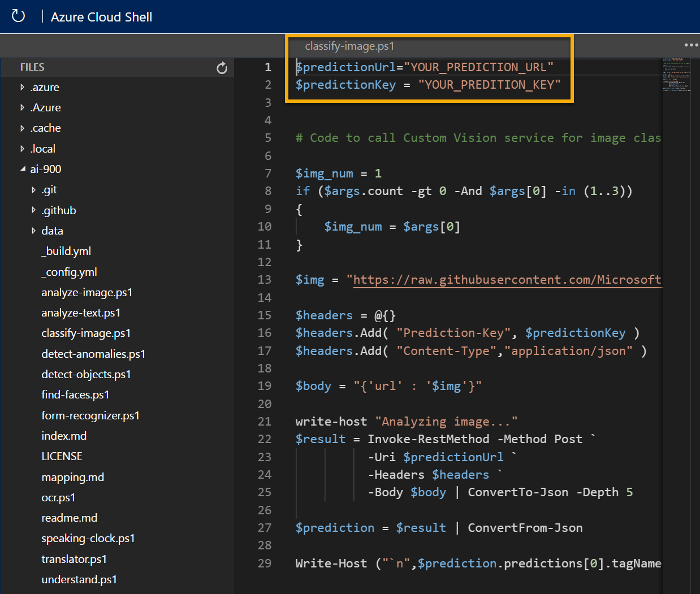

---
lab:
  title: 探索影像分類
---

# <a name="explore-image-classification"></a>探索影像分類

> **注意** 若要完成此實驗室，您需要一個具備[系統管理存取權](https://azure.microsoft.com/free?azure-portal=true)的 Azure 訂用帳戶。

*電腦視覺*認知服務提供了實用的預建模型來處理影像，但針對電腦視覺，您通常需要定型自己的模型。 例如，假設 Northwind Traders 零售公司想要建立自動結帳系統，根據結帳櫃台的相機所拍攝的影像來識別客戶想要購買的商品。 若要這樣做，您必須定型分類模型，以將用來識別所購買商品的影像分類。

在 Azure 中，您可以使用***自訂視覺***認知服務，根據現有影像來定型影像分類模型。 建立影像分類解決方案有兩個要素。 首先，您必須訓練模型，以使用現有影像來辨識不同的類別。 然後，模型完成定型時，您必須將其發佈為服務以供應用程式使用。

為了測試自訂視覺服務的功能，我們會使用在 Cloud Shell 中執行的簡單命令列應用程式。 真實世界的解決方案也適用相同準則與功能，例如網站或手機應用程式。

## <a name="create-a-cognitive-services-resource"></a>建立「認知服務」資源

您可以建立**自訂視覺**資源或**認知服務**資源，以使用自訂視覺服務。

>**注意** 並非所有區域都有提供這些資源。 無論您建立的是自訂視覺資源或認知服務資源，只有在[特定區域](https://azure.microsoft.com/global-infrastructure/services/?products=cognitive-services)中建立的資源才能用於存取自訂視覺服務。 為了簡單起見，以下設定指示會預先為您選取某個區域。

在 Azure 訂閱中建立**認知服務**資源。

1. 在另一個瀏覽器索引標籤中，開啟位於 [https://portal.azure.com](https://portal.azure.com?azure-portal=true) 的 Azure 入口網站，並使用您的 Microsoft 帳戶登入。

1. 按一下 [&#65291;建立資源] 按鈕，搜尋「認知服務」，然後使用下列設定建立**認知服務**資源：
    - **訂用帳戶**：*您的 Azure 訂用帳戶*。
    - **資源群組**：*選取或建立具有唯一名稱的資源群組*。
    - **區域**：美國東部
    - **名稱**：輸入唯一名稱。
    - **定價層**:標準 S0
    - **核取此方塊表示我已閱讀並了解下列所有條款**：選取。

1. 檢閱並建立資源，然後等候部署完成。 接著，移至所部署的資源。

1. 檢視認知服務資源的 [金鑰與端點] 頁面。 您需要有端點和金鑰，才能從用戶端應用程式連線。

## <a name="create-a-custom-vision-project"></a>建立自訂視覺專案

若要訓練物件偵測模型，您必須根據訓練資源來建立自訂視覺專案。 若要這樣做，您要使用自訂視覺入口網站。

1. 從 https://aka.ms/fruit-images 下載並擷取定型影像。 這些影像會以 zip 壓縮資料夾提供，此資料夾在解壓縮後會包含名為 **apple**、**banana** 和 **orange** 的子資料夾。

1. 在另一個瀏覽器索引標籤中，開啟位於 [https://customvision.ai](https://customvision.ai?azure-portal=true) 的自訂視覺入口網站。 如果出現提示，請使用與 Azure 訂用帳戶相關聯的 Microsoft 帳戶進行登入，並同意服務條款。

1. 在自訂視覺入口網站中，使用下列設定建立新的專案：

    - **名稱**：商品結帳櫃台
    - **描述**：商品的影像分類
    - **資源**：*您先前建立的自訂視覺資源*
    - **專案類型**：分類
    - **分類類型**：多類別 (每個影像一個標記)
    - **領域**：食物

1. 按一下 [新增影像]，然後選取先前解壓縮的 **apple** 資料夾中的所有檔案。 然後上傳影像檔案，指定蘋果標記，如下所示：

    

1. 重複上一個步驟以便上傳香蕉資料夾中帶有香蕉標記的影像，以及柳橙資料夾中帶有柳橙標記的影像。

1. 瀏覽您已經在自訂視覺專案中上傳的影像，每個類別應該有 15 個影像，如下所示：

    

1. 在自訂視覺專案中，影像的上方，按一下 [訓練] 以使用已標記的影像訓練分類模型。 選取 [快速定型] 選項，然後等候定型反覆項目完成 (這可能需要一分鐘左右的時間)。

1. 當模型反覆項目已完成定型時，請檢閱*精確度*、*重新叫用率*和 *AP* 效能計量 - 這些計量會測量分類模型的預測精確度，而且值應該都很高。

## <a name="test-the-model"></a>測試模型

在發佈此模型反覆項目以供應用程式使用之前，請先進行測試。

1. 在效能計量上方，按一下 [快速測試]。

1. 在 [影像 URL] 方塊中，輸入 `https://aka.ms/apple-image`，然後按一下 &#10132;

1. 檢視您的模型退回的預測，蘋果的可能性分數應該是最高的，如下所示：

    

1. 關閉 [快速測試] 視窗。

## <a name="publish-the-image-classification-model"></a>發佈影像分類模型

現在，您已準備好發佈已定型的模型，並從用戶端應用程式使用此模型。

1. 按一下 [&#128504; 發佈]，使用下列設定發佈已定型的模型：
    - **模型名稱**：商品
    - **預測資源**：*您先前建立的預測資源*。

1. 發佈之後，按一下 [預測 URL](&#127760;) 圖示，以查看使用已發佈的模型所需的資訊。 之後，您需要適當的 URL 與 Prediction-Key 值，才能從影像 URL 取得預測，因此請讓此對話方塊保持開啟，並繼續進行下一個工作。 

## <a name="run-cloud-shell"></a>執行 Cloud Shell

為了測試自訂視覺服務的功能，我們會使用在 Azure 上的 Cloud Shell 中執行的簡單命令列應用程式。

1. 在 Azure 入口網站中，選取頁面頂端在搜尋方塊右邊的 **[>_]** (Cloud Shell) 按鈕。 這會在入口網站底部開啟 Cloud Shell 窗格。 

    

1. 第一次開啟 Cloud Shell 時，系統可能會提示您選擇要使用的殼層類型 (*Bash* 或 *PowerShell*)。 選取 [PowerShell]。 如果沒有看到此選項，請略過該步驟。  

1. 如果系統提示您為 Cloud Shell 建立儲存體，請確定您已指定訂用帳戶，然後選取 [建立儲存體]。 然後，請等候一分鐘左右，讓系統建立儲存體。

    [](media/create-image-classification-system/powershell-portal-guide-2.png#lightbox)

1. 請確認 [Cloud Shell] 窗格左上方指出的殼層類型已切換為 [PowerShell]。 如果其類型為 *Bash*，請使用下拉式功能表切換為 *PowerShell*。

    

1. 等候 PowerShell 啟動。 您應該會在 Azure 入口網站中看到下列畫面：  

    

## <a name="configure-and-run-a-client-application"></a>設定和執行用戶端應用程式

現在您已擁有 Cloud Shell 環境，接下來，您可以執行簡單的應用程式以使用自訂視覺服務來分析影像。

1. 在命令殼層中，輸入下列命令以下載範例應用程式，並將其儲存至名為 ai-900 的資料夾。 

    ```PowerShell
    git clone https://github.com/MicrosoftLearning/AI-900-AIFundamentals ai-900
    ```

    >**提示** 若您已在另一個實驗室中使用此命令來複製 *ai-900* 存放庫，則可跳過此步驟。

1. 檔案會下載至名為 **ai-900** 的資料夾。 現在我們想要查看 Cloud Shell 儲存體中的所有檔案，並使用這些檔案。 在殼層中輸入下列命令：

    ```PowerShell
    code .
    ```

    請注意此命令如何開啟編輯器，情況如下圖： 

    

1. 在左側的 [檔案] 窗格中，展開 [ai-900]，然後選取 [classify-image.ps1]。 此檔案包含一些使用自訂視覺模型來分析影像的程式碼，如下所示：

     

1. 請勿太過在意程式碼的詳細資料，因為使用影像 URL 時，重點在於其需要自訂視覺模型的預測 URL 與金鑰。 

   從自訂視覺專案中的對話方塊取得「預測 URL」。 

   >**注意** 回想一下，在發佈影像分類模型之後，您已檢閱「預測 URL」。 若要尋找「預測 URL」，請巡覽至專案中的 [效能] 索引標籤，然後按一下 [Prediction URL] (預測 URL) (若畫面已壓縮，您可能只會看到地球圖示)。 對話方塊隨即出現。 複製 [If you have an image URL] (若您有影像 URL) 的 URL。 將其貼入程式碼編輯器中，取代 **YOUR_PREDICTION_URL**。

    使用相同的對話方塊，取得「預測金鑰」。 複製 [Set Prediction-Key Header to] (將 Prediction-Key 標頭設定為) 後面所顯示的預測金鑰。 將其貼入程式碼編輯器中，取代 **YOUR_PREDICTION_KEY** 預留位置值。

    

    貼上預測 URL 與預測金鑰值之後，前兩行程式碼看起來應該類似這樣：

    ```PowerShell
    $predictionUrl="https..."
    $predictionKey ="1a2b3c4d5e6f7g8h9i0j...."
    ```

1. 在編輯器窗格右上方，使用 [...] 按鈕開啟功能表，然後選取 [儲存] 以儲存變更。 然後再次開啟功能表，並選取 [關閉編輯器]。

    您會使用範例用戶端應用程式，將數個影像分類為 apple、banana 或 orange 類別。

1. 我們會分類此影像：

    

    在 PowerShell 窗格中，輸入下列命令來執行程式碼：

    ```PowerShell
    cd ai-900
    ./classify-image.ps1 1
    ```

1. 檢閱預測，值應該會是 **apple**。

1. 現在讓我們嘗試另一個影像：

    

    請執行這個命令：

    ```PowerShell
    ./classify-image.ps1 2
    ```

1. 確認模型將此影像分類為 **banana**。

1. 最後，讓我們嘗試第三個測試影像：

    

    請執行這個命令：

    ```PowerShell
    ./classify-image.ps1 3
    ```

1. 確認模型將此影像分類為 **orange**。

## <a name="learn-more"></a>深入了解

此簡單的應用程式只顯示了自訂視覺服務的部分功能。 若要深入了解此服務的功能，請參閱[自訂視覺](https://azure.microsoft.com/services/cognitive-services/custom-vision-service/)頁面。
