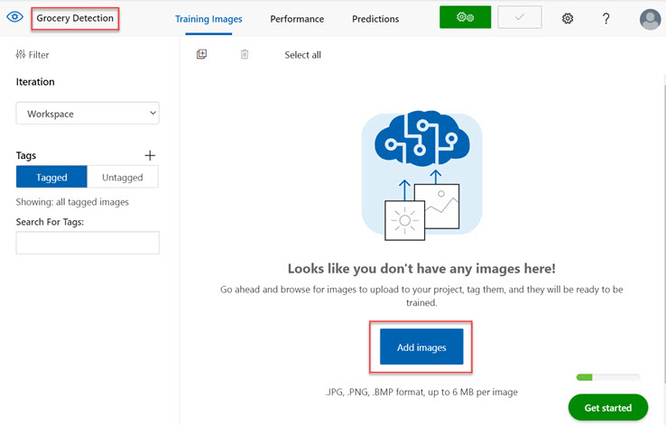

---
lab:
  title: 探索物件偵測
---

# <a name="explore-object-detection"></a>探索物件偵測

> **注意** 若要完成此實驗室，您需要一個具備[系統管理存取權](https://azure.microsoft.com/free?azure-portal=true)的 Azure 訂用帳戶。

*物件偵測*是一種電腦視覺形式，其中機器學習模型會進行訓練，以分類影像中物件的個別執行個體，並指出標示其位置的「周框方塊」。 您可以將此視為「影像分類」的進展 (其中模型會回答「影像是什麼？」的問題)，以建置可詢問模型「此影像中有什麼物件？這些物件在哪？」的解決方案。

例如，商店可能會使用物件偵測模型來實作自動化結帳系統，以使用相機掃描輸送帶，並且不需要將每個項目放在帶上並個別掃描，即可識別特定項目。

Microsoft Azure 中的**自訂視覺**認知服務提供雲端式解決方案，用於建立及發佈自訂物件偵測模型。 在 Azure 中，您可以使用自訂視覺服務，根據現有影像來訓練影像分類模型。 建立影像分類解決方案有兩個要素。 首先，您必須訓練模型，以使用現有影像來辨識不同的類別。 然後，模型經訓練後，您必須將其發佈為服務以供應用程式取用。

為了測試自訂視覺服務用來偵測影像中物件的功能，我們會使用在 Cloud Shell 中執行的簡單命令列應用程式。 真實世界的解決方案也適用相同準則與功能，例如網站或手機應用程式。

## <a name="create-a-cognitive-services-resource"></a>建立「認知服務」資源

您可以建立**自訂視覺**資源或**認知服務**資源，以使用自訂視覺服務。

> **注意** 並非所有區域都有提供這些資源。 無論您建立的是自訂視覺資源或認知服務資源，只有在[特定區域](https://azure.microsoft.com/global-infrastructure/services/?products=cognitive-services)中建立的資源才能用於存取自訂視覺服務。 為了簡單起見，以下設定指示會預先為您選取某個區域。

在 Azure 訂閱中建立**認知服務**資源。

1. 在另一個瀏覽器索引標籤中，開啟位於 [https://portal.azure.com](https://portal.azure.com?azure-portal=true) 的 Azure 入口網站，並使用您的 Microsoft 帳戶登入。

1. 按一下 [&#65291;建立資源] 按鈕，搜尋「認知服務」，然後使用下列設定建立**認知服務**資源：
    - **訂用帳戶**：*您的 Azure 訂用帳戶*。
    - **資源群組**：*選取或建立具有唯一名稱的資源群組*。
    - **區域**：美國東部
    - **名稱**：輸入唯一名稱。
    - **定價層**:標準 S0
    - **核取此方塊表示我已閱讀並了解下列所有條款**：選取。

1. 檢閱並建立資源，然後等候部署完成。 接著，移至所部署的資源。

1. 檢視認知服務資源的 [金鑰與端點] 頁面。 您需要有端點和金鑰，才能從用戶端應用程式連線。

## <a name="create-a-custom-vision-project"></a>建立自訂視覺專案

若要訓練物件偵測模型，您必須根據訓練資源來建立自訂視覺專案。 為此，您將使用自訂視覺入口網站。

1. 在新的瀏覽器索引標籤中，開啟位於 [https://customvision.ai](https://customvision.ai?azure-portal=true) 的自訂視覺入口網站，並使用與您的 Azure 訂用帳戶相關聯的 Microsoft 帳戶登入。

1. 建立包含下列設定的新專案：
    - **名稱**：雜貨店偵測
    - **描述**：針對雜貨店進行物件偵測。
    - **資源**：您先前建立的資源
    - **專案類型**：物件偵測
    - **網域**：一般

1. 等候專案建立並在瀏覽器中開啟。

## <a name="add-and-tag-images"></a>新增並標記影像

若要訓練物件偵測模型，您必須上傳影像 (其包含想要模型識別的類別)，並加以標記來表示每個物件執行個體的周框方塊。

1. 從 https://aka.ms/fruit-objects 下載並擷取正在訓練的影像。 擷取的資料夾包含水果影像的集合。

1. 在自訂視覺入口網站 [https://customvision.ai](https://customvision.ai?azure-portal=true) 中，確定您在物件偵測專案「雜貨店偵測」中工作。 然後選取 [新增影像]，並上傳解壓縮資料夾中的所有影像。

    

1. 影像上傳完成後，選取第一個加以開啟。

1. 將滑鼠游標暫留在影像中的任一物件上，直到如下影像顯示自動偵測的區域。 然後選取物件，如有必要調整區域大小以便將其環繞。

    

    或者，您可以簡單地在物件周圍拖曳以建立區域。

1. 當區域環繞物件時，新增具有適當物件類型 (蘋果、香蕉或柳橙) 的新標籤，如下所示：

    

1. 選取並標記影像中的每個其他物件，調整區域大小並根據需要新增新標籤。

    

1. 使用右側的 **>** 連結移到下一個影像，並標記其物件。 然後，只需繼續處理整個影像集合物件，標記每個蘋果、香蕉和柳橙即可。

1. 完成對最後一個影像的標記後，請關閉 [影像詳細資料] 編輯器，然後在 [訓練影像] 頁面上的 [標記] 下，選取 [已標記] 以查看所有已標記的影像：

    

## <a name="train-and-test-a-model"></a>訓練並測試模型

現在您已經在專案中標記影像，可開始訓練模型。

1. 在自訂視覺專案中，按一下 [訓練] 以使用已標記的影像來訓練物件偵測模型。 選取 [Quick Training] (快速訓練) 選項。

1. 等候訓練完成 (這可能需要十分鐘左右)，然後檢閱「精確度」、「重新叫用」與「對應」效能計量，這些計量會測量物件偵測模型的預測健全度，且各項計量應該都會相當高。

1. 在頁面的右上方，按一下 [Quick Test] (快速測試)，然後在 [影像 URL] 方塊中，輸入 `https://aka.ms/apple-orange` 並檢視所產生的預測。 然後關閉 [Quick Test] (快速測試) 視窗。

## <a name="publish-the-object-detection-model"></a>發佈物件偵測模型

現在，您已準備好發佈已訓練的模型，並從用戶端應用程式加以使用。

1. 按一下 [&#128504; 發佈]，使用下列設定發佈已定型的模型：
    - **模型名稱**：detect-produce
    - **預測資源**：您先前建立的資源。

1. 發佈之後，按一下 [預測 URL](&#127760;) 圖示，以查看使用已發佈的模型所需的資訊。 之後，您需要適當的 URL 與 Prediction-Key 值，才能從影像 URL 取得預測，因此請讓此對話方塊保持開啟，並繼續進行下一個工作。

## <a name="run-cloud-shell"></a>執行 Cloud Shell

為了測試自訂視覺服務的功能，我們會使用在 Azure 上的 Cloud Shell 中執行的簡單命令列應用程式。

1. 在 Azure 入口網站中，選取頁面頂端在搜尋方塊右邊的 **[>_]** (Cloud Shell) 按鈕。 這會在入口網站底部開啟 Cloud Shell 窗格。 

    

1. 第一次開啟 Cloud Shell 時，系統可能會提示您選擇要使用的殼層類型 (*Bash* 或 *PowerShell*)。 選取 [PowerShell]。 如果沒有看到此選項，請略過該步驟。  

1. 如果系統提示您為 Cloud Shell 建立儲存體，請確定您已指定訂用帳戶，然後選取 [建立儲存體]。 然後，請等候一分鐘左右，讓系統建立儲存體。

    

1. 請確定 Cloud Shell 窗格左上方所指出的殼層類型已切換為 *PowerShell*。 如果其類型為 *Bash*，請使用下拉式功能表切換為 *PowerShell*。

     

1. 等候 PowerShell 啟動。 您應該會在 Azure 入口網站中看到下列畫面：  

     

## <a name="configure-and-run-a-client-application"></a>設定及執行用戶端應用程式

現在您已擁有自訂模型，可以執行簡單的用戶端應用程式，其使用自訂視覺服務來偵測影像中的物件。

1. 在命令殼層中，輸入下列命令以下載範例應用程式，並將其儲存至名為 ai-900 的資料夾。

    ```PowerShell
    git clone https://github.com/MicrosoftLearning/AI-900-AIFundamentals ai-900
    ```

    >**注意** 若您已在另一個實驗室中使用此命令來複製 *ai-900* 存放庫，則可跳過此步驟。

1. 檔案會下載到名為 **ai-900** 的資料夾。 現在我們想要查看 Cloud Shell 儲存體中的所有檔案，並使用這些檔案。 在殼層中輸入下列命令：

    ```PowerShell
    code .
    ```

    請注意此命令如何開啟編輯器，情況如下圖： 

    

1. 在左側的 [檔案] 窗格中，展開 **ai-900**，然後選取 **detect-objects.ps1**。 此檔案包含一些使用自訂視覺服務來偵測影像物件的程式碼，如下所示：

    

1. 請勿太過在意程式碼的詳細資料，因為使用影像 URL 時，重點在於其需要自訂視覺模型的預測 URL 與金鑰。 

    從自訂視覺專案中的對話方塊取得「預測 URL」。 

    >**注意** 回想一下，在發佈影像分類模型之後，您已檢閱「預測 URL」。 若要尋找「預測 URL」，請巡覽至專案中的 [效能] 索引標籤，然後按一下 [Prediction URL] (預測 URL) (若畫面已壓縮，您可能只會看到地球圖示)。 對話方塊會隨即出現。 複製 [If you have an image URL] (若您有影像 URL) 的 URL。 將其貼入程式碼編輯器中，取代 **YOUR_PREDICTION_URL**。 

    使用相同的對話方塊，取得「預測金鑰」。 複製 [Set Prediction-Key Header to] (將 Prediction-Key 標頭設定為) 後面所顯示的預測金鑰。 將其貼入程式碼編輯器中，取代 **YOUR_PREDICTION_KEY** 預留位置值。 

    

    貼上預測 URL 與預測金鑰值之後，前兩行程式碼看起來應該類似這樣：

    ```PowerShell
    $predictionUrl="https..."
    $predictionKey ="1a2b3c4d5e6f7g8h9i0j...."
    ```

1. 在編輯器窗格右上方，使用 [...] 按鈕開啟功能表，然後選取 [儲存] 以儲存變更。 然後再次開啟功能表，並選取 [關閉編輯器]。

    您將使用範例用戶端應用程式來偵測此影像中的物件：

    

1. 在 PowerShell 窗格中，輸入下列命令來執行程式碼：

    ```PowerShell
    cd ai-900
    ./detect-objects.ps1 
    ```

1. 檢閱預測，應該是 *apple orange banana*。

## <a name="learn-more"></a>深入了解

此簡單的應用程式只顯示了自訂視覺服務的部分功能。 若要深入了解此服務的功能，請參閱[自訂視覺](https://azure.microsoft.com/services/cognitive-services/custom-vision-service/)頁面。
