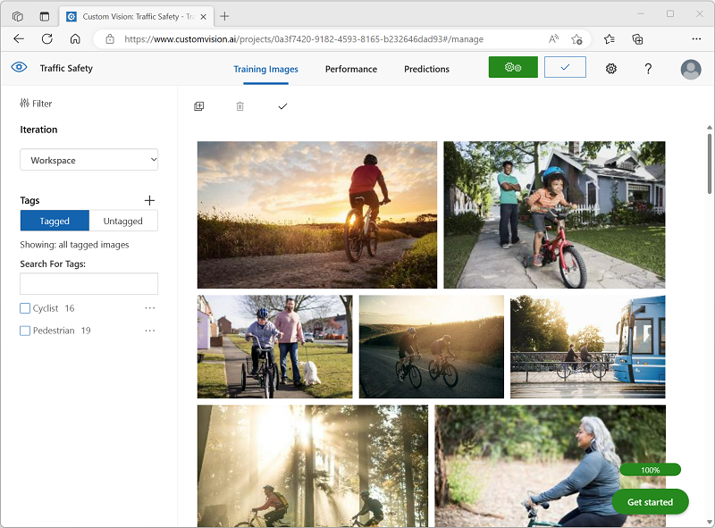

---
lab:
  title: 探索物件偵測
---

# 探索物件偵測

> **注意** 若要完成此實驗室，您需要一個具備[系統管理存取權](https://azure.microsoft.com/free?azure-portal=true)的 Azure 訂用帳戶。

*物件偵測*是一種電腦視覺形式，其中機器學習模型會進行訓練，以分類影像中物件的個別執行個體，並指出標示其位置的「周框方塊」**。 您可以將此視為「影像分類」** 的進展 (其中模型會回答「影像是什麼？」的問題)，以建置可詢問模型「此影像中有什麼物件？這些物件在哪？」的解決方案。

例如，道路安全倡議可能會將行人和騎自行車的人識別為交通交叉口最脆弱的道路消費者。 藉由使用相機來監視交叉路口，可以分析道路使用者的影像來偵測行人和騎自行車的人，以監視其號碼，甚至變更交通信號的行為。

**Microsoft Azure 中的 自訂視覺** 服務提供雲端式解決方案，可用來建立及發佈自定義物件偵測模型。 在 Azure 中，您可以使用 自訂視覺 服務，根據現有的影像來定型物件偵測模型。 建立物件偵測解決方案有兩個元素。 首先，您必須定型模型，才能使用加上標籤的影像來偵測物件的位置和類別。 然後，模型完成定型時，您必須將其發佈為服務以供應用程式使用。

為了測試自訂視覺服務用來偵測影像中物件的功能，我們會使用在 Cloud Shell 中執行的簡單命令列應用程式。 相同的原則與功能適用於現實世界的解決方案，例如網站或行動應用程式。

## 建立 *Azure AI 服務*資源

您可以透過建立**自訂視覺**資源或 **Azure AI 服務**資源，以使用自訂視覺服務。

> **注意** 並非所有區域都有提供這些資源。 無論您建立 自訂視覺 或 Azure AI 服務資源，只有在特定[區域中](https://azure.microsoft.com/global-infrastructure/services/?products=cognitive-services)建立的資源才能存取 自訂視覺 服務。 為了簡單起見，以下設定指示會預先為您選取某個區域。

在 Azure 訂閱建立 **Azure AI 服務**資源。

1. 在另一個瀏覽器索引標籤中，開啟位於 [https://portal.azure.com](https://portal.azure.com?azure-portal=true) 的 Azure 入口網站，並使用您的 Microsoft 帳戶登入。

1. 按一下 **＋建立資源 **按鈕並搜尋  * Azure AI 服務 *。 選取**建立** **Azure AI 服務**方案。 系統會帶您前往建立 Azure AI 服務資源的頁面。 使用下列設定對其進行設定：
    - **訂用帳戶**：*您的 Azure 訂用帳戶*。
    - **資源群組**：*選取或建立具有唯一名稱的資源群組*。
    - **區域**：美國東部
    - **名稱**：*輸入唯一名稱*。
    - **定價層**:標準 S0
    - **核取此方塊表示我已閱讀並了解下列所有條款**：選取。

1. 檢閱並建立資源，然後等候部署完成。 接著，移至所部署的資源。

1. 檢視 Azure AI 服務資源的**金鑰與端點**頁面。 您需要有端點和金鑰，才能從用戶端應用程式連線。

## 建立自訂視覺專案

若要訓練物件偵測模型，您必須根據訓練資源來建立自訂視覺專案。 為此，您將使用自訂視覺入口網站。

1. 在新的瀏覽器索引標籤中，開啟位於 [https://customvision.ai](https://customvision.ai?azure-portal=true) 的自訂視覺入口網站，並使用與您的 Azure 訂用帳戶相關聯的 Microsoft 帳戶登入。

1. 建立包含下列設定的新專案：
    - **名稱**：流量 保管庫
    - **描述**：道路安全的物件偵測。
    - **資源**：您先前建立的資源**
    - **專案類型**：物件偵測
    - **** 網域：一般 \[A1]

1. 等候專案建立並在瀏覽器中開啟。

## 新增並標記影像

若要訓練物件偵測模型，您必須上傳影像 (其包含想要模型識別的類別)，並加以標記來表示每個物件執行個體的周框方塊。

1. 從 [https://aka.ms/traffic-images](https://aka.ms/traffic-images) 下載並擷取正在訓練的影像。 擷取的資料夾包含騎自行車者和行人的影像集合。

1. 在 自訂視覺 入口網站中，於 **[流量] 保管庫 ty** 物件偵測專案中，選取 [**新增影像**]，並上傳解壓縮資料夾中的所有影像。

    ![自訂視覺 Studio 中 [影像上傳] 對話框的螢幕快照。](media/create-object-detection-solution/upload-images.png)

1. 影像上傳完成後，選取第一個加以開啟。

1. 將滑鼠停留在影像中的任何物件上（騎自行車者或行人），直到自動偵測到的區域顯示為止。 然後選取物件，如有必要，請調整區域大小以將其環繞。 或者，您可以簡單地在物件周圍拖曳以建立區域。

    在矩形區域內緊密選取物件時，請輸入對象的適當標籤（Cyclist 或 Pedestrian），並使用 **[標記區域**]****+ 按鈕將標籤新增至專案。****

    

1. 使用右側的 [ **下一個** ] （**（>）** 連結來移至下一個影像，並標記其物件。 然後，只要持續處理整個圖像集合，標記每個騎自行車的人和行人。

    當您標記影像時，請注意下列事項：

    - 某些影像包含多個物件，可能是不同類型的物件。 標記每一個，即使它們重疊也一樣。
    - 標記輸入一次之後，您可以在標記新物件時從清單中選取它。
    - 您可以透過影像來迴轉，以調整標籤。

    

1. 完成對最後一個影像的標記時，請關閉 [Image Detail] (影像詳細資料)**** 編輯器，然後在 [Training Images] (訓練影像)**** 頁面上的 [標籤]**** 下，選取 [已標記] **** 以查看所有已標記的影像：

    

## 訓練並測試模型

現在您已經在專案中標記影像，可開始訓練模型。

1. 在自訂視覺專案中，按一下 [訓練]**** 以使用已標記的影像來訓練物件偵測模型。 選取 [Quick Training] (快速訓練)**** 選項。

    > **提示**：訓練可能需要幾分鐘的時間。 當您在等候時，請查看 [智慧城市的](https://www.microsoft.com/research/video/video-analytics-for-smart-cities/)影片分析，其中描述在道路安全改進計劃中使用計算機視覺的實際專案。

2. 定型完成時，請檢閱 *精確度*、 *召回*率和 *mAP* 效能計量-這些計量會測量對象偵測模型的預測良好性，而且都應該相當高。

3. 調整左邊的 **機率臨界值** ，將其從 50% 增加到 90%，並觀察對效能計量的影響。 此設定會決定每個標記評估必須符合或超過的機率值，才能計算為預測。

    

4. 在頁面右上方，按兩下 [**快速測試**]，然後在 [影像URL **] 方塊中**輸入`https://aka.ms/pedestrian-cyclist`並檢視結果。

    在右側窗格的 [預測 **] 底下**，每個偵測到的對象都會以其標記和機率列出。 選取每個物件，以查看影像中反白顯示的物件。

    預測的物件可能不是全部正確 -畢竟，騎自行車者和行人共用許多常見的特徵。 模型最有信心的預測具有最高的機率值。 **使用 [臨界值]** 滑桿可消除機率低的物件。 您應該能夠找到只包含正確預測的點（可能約為 85-90%）。

    

5. 然後關閉 [Quick Test] (快速測試)**** 視窗。

## 發佈物件偵測模型

現在，您已準備好發佈已定型的模型，並從用戶端應用程式使用此模型。

1. 按一下 [&#128504; 發佈]****，使用下列設定發佈已定型的模型：
    - **模型名稱**：交通安全
    - **預測資源**：您先前建立的資源**。

1. 發佈之後，按一下 [預測 URL]**(&#127760;) 圖示，以查看使用已發佈的模型所需的資訊。

    

之後，您需要適當的 URL 與 Prediction-Key 值，才能從影像 URL 取得預測，因此請讓此對話方塊保持開啟，並繼續進行下一個工作。

## 準備用戶端應用程式

為了測試自訂視覺服務的功能，我們會使用在 Azure 上的 Cloud Shell 中執行的簡單命令列應用程式。

1. 切換回包含 Azure 入口網站的瀏覽器標籤，然後選取頁面頂端搜尋方塊右側的 **Cloud shell** (**[>_]**) 按鈕。 這會在入口網站底部開啟 Cloud Shell 窗格。

    第一次開啟 Cloud Shell 時，系統可能會提示您選擇要使用的殼層類型 (*Bash* 或 *PowerShell*)。 如果是這樣，請選取 **PowerShell**。

    如果系統提示您為 Cloud Shell 建立儲存體，請確定您已指定訂閱，然後選取**建立儲存體**。 然後等候一分鐘左右，讓系統建立儲存體。

    當 Cloud Shell 就緒時，看起來應該會像這樣：
    
    

    > **提示**：請確定 Cloud Shell 窗格左上方所指出的殼層類型已切換為 *PowerShell*。 若其類型為 *Bash*，請使用下拉式功能表切換為 *PowerShell*。

    請注意，如需調整 Cloud Shell 的大小，您可以拖曳窗格頂端的分隔線，或者使用窗格右上方的 **&#8212;**、**&#9723;**、**X** 圖示，分別將窗格最小化、最大化或關閉窗格。 如需使用 Azure Cloud Shell 的詳細資訊，請參閱 [Azure Cloud Shell 文件](https://docs.microsoft.com/azure/cloud-shell/overview)。

2. 在命令殼層中，輸入下列命令來下載此練習的檔案，並將其儲存在名為 ** ai-900 ** 的資料夾中 (如果資料夾已經存在，則刪除該資料夾後)

    ```PowerShell
    rm -r ai-900 -f
    git clone https://github.com/MicrosoftLearning/AI-900-AIFundamentals ai-900
    ```

3. 下載檔案之後，輸入下列命令以變更為 ** ai-900 ** 目錄，並編輯此練習的程式碼檔案：

    ```PowerShell
    cd ai-900
    code detect-objects.ps1
    ```

    請注意此命令如何開啟編輯器，如下圖：

     

     > **提示**：您可以使用 Cloud Shell 命令列與程式碼編輯器之間的分隔線來調整窗格的大小。

4. 不用太過顧慮程式碼的細節。 重要的是，它以一些程式碼開頭來指定自訂視覺模型的預測 URL 與金鑰。 您需要更新這些，以便其餘程式碼使用您的模型。

    從自訂視覺專案的瀏覽器索引標籤開啟的對話方塊取得*預測 URL* 以及*預測金鑰*。 如果您有映像 URL *，則需要使用*版本。

    使用這些值來取代程式碼檔案中的 **YOUR_PREDICTION_URL** 及 **YOUR_PREDICTION_KEY** 預留位置。

    貼上預測 URL 與預測金鑰值之後，前兩行程式碼看起來應該類似這樣：

    ```PowerShell
    $predictionUrl="https..."
    $predictionKey ="1a2b3c4d5e6f7g8h9i0j...."
    ```

5. 對程式碼中的變數進行變更之後，請按 ** CTRL+S ** 儲存檔案。 然後按 **CTRL+Q** 關閉程式碼編輯器。

## 測試用戶端應用程式

現在您可以使用範例用戶端應用程式來偵測影像中的騎自行車者和行人。

1. 在 PowerShell 窗格中，輸入下列命令來執行程式碼：

    ```PowerShell
    ./detect-objects.ps1 1
    ```

    此程式代碼會使用您的模型來偵測下圖中的物件：

    

1. 檢閱預測，其中列出任何偵測到的機率為 90% 或以上的物件，以及其位置周圍周框方塊的座標。

1. 現在讓我們嘗試另一個影像。 執行此命令：

    ```PowerShell
    ./detect-objects.ps1 2
    ```

    這次會分析下圖：

    

希望您的物件偵測模型在測試影像中能夠偵測行人和騎自行車的人。

