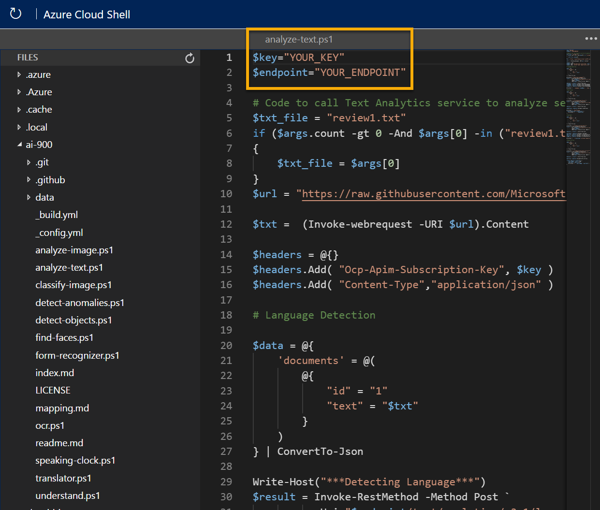

---
lab:
  title: 探索文字分析
---

# 探索文字分析

> **注意** 若要完成此實驗室，您需要一個具備[系統管理存取權](https://azure.microsoft.com/free?azure-portal=true)的 Azure 訂用帳戶。

自然語言處理 (NLP) 是人工智慧 (AI) 的分支，負責處理書寫或口語語言。 您可以使用 NLP 來建置解決方案，以從文字或語音擷取語意，或以自然語言撰寫有意義的回應。

Microsoft *Azure AI 服務*包含*語言*服務中的文字分析功能，其提供一些現成可用的 NLP 功能，包括識別文字中的關鍵字組，以及根據情感的文字分類。

例如，假設虛構的 *Margie's Travel* 組織鼓勵客戶提交旅館住宿的評論。 您可以使用語言服務來摘要評論，方法是擷取關鍵字組、判斷哪些評論為正面和負面，或分析檢閱文字中是否有提及已知實體，例如地點或人。

為了測試語言服務的功能，我們會使用在 Cloud Shell 中執行的簡單命令列應用程式。 真實世界的解決方案也適用相同準則與功能，例如網站或手機應用程式。

## 建立 *Azure AI 服務*資源

您可以建立**語言**資源或 **Azure AI 服務**資源，以使用語言服務。

如果您尚未建立此資源，請在 Azure 訂閱中建立 **Azure AI 服務**資源。

1. 在另一個瀏覽器索引標籤中，開啟位於 [https://portal.azure.com](https://portal.azure.com?azure-portal=true) 的 Azure 入口網站，並使用您的 Microsoft 帳戶登入。

1. 按一下 **＋建立資源 **按鈕並搜尋  * Azure AI 服務 *。 選取**建立** **Azure AI 服務**方案。 系統會帶您前往建立 Azure AI 服務資源的頁面。 使用下列設定對其進行設定：
    - **訂用帳戶**：*您的 Azure 訂用帳戶*。
    - **資源群組**：*選取或建立具有唯一名稱的資源群組*。
    - **區域**：選擇任何可用的區域**。
    - **名稱**：*輸入唯一名稱*。
    - **定價層**:標準 S0
    - **核取此方塊表示我已閱讀並了解下列所有條款**：選取。

1. 檢閱並建立資源。

### 取得 Azure AI 服務資源的金鑰與端點

1. 等候部署完成。 接下來，移至您的 Azure AI 服務資源，在 [概觀]**** 頁面選取管理服務金鑰的連結。 您需要端點和金鑰，才能從用戶端應用程式連線到 Azure AI 服務資源。

1. 檢視資源的 [金鑰和端點]**** 頁面。 您需要**金鑰**和**端點**，才能從用戶端應用程式連線。

## 執行 Cloud Shell

為了測試語言服務的文字分析功能，我們將使用在 Azure 上的 Cloud Shell 中執行的簡單命令列應用程式。

1. 在 Azure 入口網站中，選取頁面頂端在搜尋方塊右邊的 **[>_]** (Cloud Shell**) 按鈕。 這會在入口網站底部開啟 Cloud Shell 窗格。

    

1. 第一次開啟 Cloud Shell 時，系統可能會提示您選擇要使用的殼層類型 (*Bash* 或 *PowerShell*)。 選取 [PowerShell]****。 若未看到此選項，請略過該步驟。  

1. 如果系統提示您為 Cloud Shell 建立儲存體，請確定您已指定訂用帳戶，然後選取 [建立儲存體]****。 然後等候一分鐘左右，讓系統建立儲存體。

    

1. 請確定 Cloud Shell 窗格左上方所指出的殼層類型已切換為 *PowerShell*。 若其類型為 *Bash*，請使用下拉式功能表切換為 *PowerShell*。

    

1. 等候 PowerShell 啟動。 您應該會在 Azure 入口網站中看到下列畫面：  

    

## 設定和執行用戶端應用程式

現在您已擁有自訂模型，您可以執行使用語言服務的簡單用戶端應用程式。

1. 在命令殼層中，輸入下列命令以下載範例應用程式，並將其儲存至名為 ai-900 的資料夾。

    ```PowerShell
    git clone https://github.com/MicrosoftLearning/AI-900-AIFundamentals ai-900
    ```

    >**提示** 若您已在另一個實驗室中使用此命令來複製 *ai-900* 存放庫，則可跳過此步驟。

1. 檔案會下載到名為 **ai-900** 的資料夾。 現在我們要查看 Cloud Shell 儲存體中的所有檔案，並使用這些檔案。 在殼層中輸入下列命令：

     ```PowerShell
    code .
    ```

    請注意此命令如何開啟編輯器，如下圖：

    

1. 在左側的 [檔案]**** 窗格中，展開 **ai-900**，然後選取 **analyze-text.ps1**。 此檔案包含一些使用語言工具服務的程式碼：

    

1. 不用太過顧慮程式碼的細節。 在 Azure 入口網站中，瀏覽至您的 Azure AI 服務資源。 然後選取左側窗格中的 [金鑰和端點]**** 頁面。 從該頁面複製金鑰和端點，並將其貼上到程式碼編輯器中，分別取代 **YOUR_KEY** 和 **YOUR_ENDPOINT** 預留位置值。

    > **提示** 使用 [金鑰和端點]**** 與 [編輯器]**** 窗格時，您可能必須使用分隔線來調整螢幕區域。

    ![在 Azure AI 服務資源的左側窗格中尋找 [金鑰和端點] 索引標籤。](media/analyze-text-language-service/key-endpoint-support.png)

    在取代金鑰和端點值之後，程式碼的前幾行應該會類似以下：

    ```PowerShell
    $key="1a2b3c4d5e6f7g8h9i0j...."
    $endpoint="https..."
    ```

1. 在編輯器窗格右上方，使用 [...]**** 按鈕開啟功能表，並選取 [儲存]**** 以儲存變更。 接著再次開啟功能表，並選取 [關閉編輯器]****。

    範例用戶端應用程式將使用 Azure AI 服務的語言服務來偵測語言、擷取關鍵字組、判斷情感，以及擷取已知實體以進行檢閱。

1. 在 Cloud Shell 中，輸入下列命令以執行程式碼：

    ```PowerShell
    cd ai-900
    ./analyze-text.ps1 review1.txt
    ```

    您將檢閱此文字：

    >旅館和員工都很好。The Royal Hotel, London, UK 3/2/2018。乾淨的房間，服務好，地點好，靠近白金漢宮和西敏寺等等。 我們在住宿期間很享受。 庭院非常安靜，我們前往屬於同集團的一家餐廳，而且是有米其林一顆星的印度餐廳 (西海岸，所有大量的魚)。 我們吃了主廚套餐，非常棒。 房間配備齊全。有廚房、休息室、卧室和大型浴室。 非常推薦。

1. 檢閱輸出。

1. 在 PowerShell 窗格中，輸入下列命令來執行程式碼：

    ```PowerShell
    ./analyze-text.ps1 review2.txt
    ```

    您將檢閱此文字：

    >服務不佳的破舊旅館。The Royal Hotel, London, United Kingdom 5/6/2018。這家是舊旅館 (自 1950 年代就已存在)，而房間傢具還算一般，但現在變得有點老舊，而需要改裝了。 網際網路不能用，而且必須前往其中一個辦公室會議室，才能幫我的回程航班劃位。 網站指出它靠近大英博物館，但太遠步行無法到達。

1. 檢閱輸出。

1. 在 PowerShell 窗格中，輸入下列命令來執行程式碼：

    ```PowerShell
    ./analyze-text.ps1 review3.txt
    ```

    您將檢閱此文字：

    >地點良好和樂於協助的員工，但在忙碌的道路上。
    The Lombard Hotel, San Francisco, USA 8/16/2018。閱讀評論之後，我們於 8 月住在這裡。 我們對位置非常滿意，就在 Chestnut 街道後方，國際化和時尚的區域，有許多餐廳可供選擇。 海港區很適合漫步，有非常有趣的房子。 請務必走到舊金山的美術博物館和海港，那邊有金門大橋和城市的良好視野。 在公車路線上，要進入市中心很輕鬆。 房間很乾淨，有許多房間，員工友善且樂於協助。 唯一缺點是 Lombard 街道的噪音，因此請要求提供最遠的房間，以遠離交通噪音。

1. 檢閱輸出。

1. 在 PowerShell 窗格中，輸入下列命令來執行程式碼：

    ```PowerShell
    ./analyze-text.ps1 review4.txt
    ```

    您將檢閱此文字：

    >很吵雜而且房間很小。The Lombard Hotel, San Francisco, USA 9/5/2018。旅館位於 Lombard 街道，這是一條非常忙碌的六線街道，就在金門大橋旁。 交通流量從清晨到深夜，特別是週末。 如果房間隔音好一點，噪音就不會那麼糟。 我必須把棉球放在我的耳朵才能睡覺，我累到隔天都無法好好享受城市。 房間很小。 我選了這個房間，因為有兩張加大雙人床，但房間的空間要放這兩張床不太夠。 四人的家庭在房間中就太窄了。 結論是房間很乾淨，而且他們已努力更新了。 旅館位於海港區，有許多好地方可用餐，且距離要塞公園是步行可到的距離。 可能是適合晚睡的年青人或預算有限成人的旅館

1. 檢閱輸出。

## 深入了解

這個簡單的應用程式只會展現語言服務的一些功能。 若要深入了解您可以使用此服務完成的動作，請參閱[語言服務頁面](https://azure.microsoft.com/services/cognitive-services/language-service/)。
