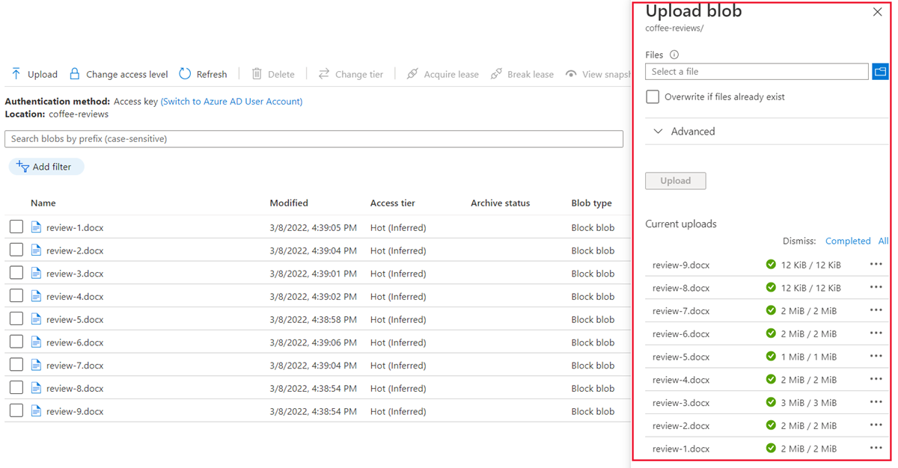

---
lab:
  title: 探索知識採礦
---

# 探索知識採礦

> **注意** 若要完成此實驗室，您需要一個具備[系統管理存取權](https://azure.microsoft.com/free?azure-portal=true)的 Azure 訂用帳戶。

想像一下您在全國咖啡連鎖店 Fourth Coffee 工作。 系統會要求您協助組建知識採礦解決方案，以便輕鬆搜尋與客戶體驗相關的深入解析。 您決定使用從客戶評論擷取的資料，組建 Azure 認知搜尋索引。  

在此實驗室中，您將採取以下行動：

- 建立 Azure 資源
- 從資料來源擷取資料
- 使用 AI 技術擴充資料
- 在 Azure 入口網站中使用 Azure 索引
- 查詢搜尋索引
- 檢閱儲存至知識存放區的結果

## 所需的 Azure 資源

您要為 Fourth Coffee 建立解決方案需要 Azure 訂閱中的下列資源：

- **Azure 認知搜尋**資源，此資源用於管理索引編製和查詢。
- **認知服務**資源，可提供 AI 服務，讓您的搜尋解決方案可用來使用 AI 產生的深入解析來擴充資料來源中的資料。

    > **注意** 您的 Azure 認知搜尋和認知服務資源必須位於相同的位置！

- 具備 Blob 容器的**儲存體帳戶**將會儲存原始文件和其他資料表、物件或檔案的集合。

### 建立 Azure 認知搜尋** 資源

1. 登入 [Azure 入口網站](https://portal.azure.com/learn.docs.microsoft.com?azure-portal=true)。

1. 按一下 [+ 建立資源]**** 按鈕，搜尋「Azure 認知搜尋」**，並使用下列設定建立 [Azure 認知搜尋]**** 資源：

    - **訂用帳戶**：*您的 Azure 訂用帳戶*。
    - **資源群組**：*選取或建立具有唯一名稱的資源群組*。
    - **服務名稱**：唯一名稱**。
    - **位置**：選擇任何可用的區域**。
    - **定價層**：基本

1. 選取 [檢閱 + 建立]****，然後在看見回應「驗證成功」**** 之後，選取 [建立]****。

1. 完成部署後，選取 [移至資源]****。 在 [Azure 認知搜尋概觀] 頁面上，您可以新增索引、匯入資料，並搜尋已建立的索引。

### 建立 Azure AI 服務資源

您必須佈建與 Azure 認知搜尋資源位居相同位置的**認知服務**資源。 您的搜尋解決方案會使用該資源搭配 AI 產生的深入解析，擴充資料存放區中的資料。

1. Azure 入口網站中首頁的影像。 **按一下 &#65291;建立資源 ** 按鈕並搜尋 * Azure AI 服務 * 。 選取 ** [建立 ** ** Azure AI 服務 ** 方案]。 系統會帶您前往頁面來建立 Azure AI 服務資源。 使用下列設定來設定  ：
    - **訂用帳戶**：*您的 Azure 訂用帳戶*。
    - **資源群組**：與您的 Azure 認知搜尋資源相同的資源群組**。
    - **區域**：與您的 Azure 認知搜尋資源相同的位置**。
    - **名稱**︰唯一名稱**。
    - **定價層**:標準 S0
    - **核取此方塊表示我已閱讀並了解下列所有條款**：選取

1. 選取 [**檢閱 + 建立**]。 您看到「驗證成功」**** 後，請選取 [建立]****。

1. 等候部署完成，然後檢視部署詳細資料。

### 建立儲存體帳戶

1. 返回　Azure 入口網站首頁，然後選取 [+ 建立資源]**** 按鈕。

1. 搜尋*儲存體帳戶*，並使用下列設定建立**儲存體帳戶**資源：
    - **訂用帳戶**：*您的 Azure 訂用帳戶*。
    - **資源群組**：與您的 Azure 認知搜尋和認知服務資源相同的資源群組**。
    - **儲存體帳戶名稱**：唯一名稱**。
    - **位置**：選擇任何可用的位置**。
    - **效能**：標準
    - **備援**：本地備援儲存體 (LRS)

1. 按一下 [檢閱]****，然後按一下 [建立]****。 等候部署完成，然後移至資源。

1. 在您建立的 Azure 儲存體帳戶中，選取左側功能表窗格中的 [容器]。
1. 將 [允許 Blob 匿名存取] 的設定 * 變更為 ** [已啟用 ** ]，然後選取 [ ** 儲存 ** ]。 *

## 將文件上傳至 Azure 儲存體

1. 在左側功能表窗格中選取 [容器]****。

    

1. 選取 [+ 容器]****。 右側窗格隨即開啟。

1. 輸入下列設定，然後按一下 [建立]****：
    - **名稱**：coffee-reviews  
    - **公用存取層級**：容器 (容器和 Blob 的匿名讀取權限)
    - **進階**：不變更**。

1. 在新的瀏覽器索引標籤中，從 https://aka.ms/km-documents 下載壓縮的文件，然後將檔案解壓縮到 reviews** 資料夾。

1. 在 Azure 入口網站中，選取 [coffee-reviews]** 容器。 在容器中選取 [上傳]****。

    

1. 在 [上傳 Blob]**** 窗格中，選取 [選取檔案]****。

1. 在探索視窗中，選取 [檢閱]** 資料夾中**所有**的檔案，再依序選取 [開啟]**** 和 [上傳]****。

    

1. 完成上傳後，您可以關閉 [上傳 Blob]**** 窗格。 您的文件現在位於 *coffee-reviews* 儲存體容器中。

## 將文件編制索引

在儲存體中擁有文件後，您可以使用 Azure 認知搜尋從文件中擷取深入解析。 Azure 入口網站提供*匯入資料精靈*。 透過此精靈，您可以針對支援的資料來源自動建立索引和索引子。 您將使用精靈來建立索引，並將搜尋文件從儲存體匯入 Azure 認知搜尋索引。

1. 在 Azure 入口網站中，瀏覽至您的 Azure 認知搜尋資源。 在 [概觀]**** 頁面上，選取 [匯入資料]****。

    

1. 在 [連接到您的資料]**** 頁面上，在 [資料來源]**** 清單上選取 [Azure Blob 儲存體]****。 使用下列值完成資料存放區詳細資料：
    - [資料來源]:選擇 Azure Blob 儲存體
    - [資料來源名稱]****：coffee-customer-data
    - [要擷取的資料]****：內容和中繼資料
    - [剖析模式]****；預設
    - [連接字串]****：*選取 [請選擇現有的連線]****。 選取您的儲存體帳戶，選取 [coffee-review]**** 容器，然後按一下 [選取]****。
    - [受控識別驗證]****：無
    - [容器名稱]****：選擇現有的連線之後會自動填入此設定**。
    - [Blob 資料夾]****：保留為空白**。
    - [描述]****：Fourth Coffee 商店的評論。

1. 選取 [下一步：新增認知技能 (選用)]****。

1. 在 [附加認知服務]**** 區段中，選取您的認知服務資源。  

1. 在 [新增擴充]**** 區段中：
    - 將 [技能集名稱]**** 變更為 **coffee-skillset**。
    - 請選取 [啟用 OCR，並將所有文字合併至 merged_content 欄位]**** 核取方塊。
        > **注意** 請務必選取 [啟用 OCR]****，才能看到所有擴充欄位選項。
    - 請確保 [來源資料欄位]**** 已設定為 [merged_content]****。
    - 將**擴充細微性等級**變更為**分頁 (5000 個字元區塊)**。
    - 不要選取 [啟用累加擴充]**
    - 選取下列擴充欄位：

        | 認知技能 | 參數 | 欄位名稱 |
        | --------------- | ---------- | ---------- |
        | 擷取位置名稱 | | 位置 |
        | 擷取關鍵片語 | | 關鍵片語 |
        | 偵測情緒 | | 情感 |
        | 從影像產生標籤 | | imageTags |
        | 從影像產生標題 | | imageCaption |

1. 在 [將擴充內容儲存至知識存放區]**** 下，選取：
    - 影像投影
    - 文件
    - 頁面
    - 關鍵片語
    - 實體
    - 映像詳細資料
    - 映像參考

    > **注意** 如果出現要求**儲存體帳戶連接字串**的警告，
    >
    > 
    >
    > 1. 選取 [請選擇現有的連線]****。 選取您稍早建立的儲存體帳戶。
    > 1. 按一下 [+ 容器] 建立名為 knowledge-store 的新容器，並將隱私權等級設定為私人，然後選取 [建立]。
    > 1. 選取 [知識存放區]**** 容器，然後按一下畫面底部的 [選取]****。

1. 選取 [Azure Blob 專案文件]****。 顯示自動填入*知識存放區*的*容器名稱*設定。 請勿變更該容器名稱。

1. 選取 [下一步: 自訂目標索引]****。 將 [索引名稱]**** 變更為 **coffee-index**。

1. 確定 [金鑰]**** 設為 **metadata_storage_path**。 將 [建議工具名稱]**** 保留空白，並自動填入**搜尋模式**。

1. 檢閱索引欄位的預設設定。 針對預設中已選取的所有欄位選取 [可篩選]****。

    

1. 選取**下一步：建立索引子**。

1. 將 [索引名稱]**** 變更為 **coffee-indexer**。

1. 維持將 [排程]**** 設為 [一次]****。

1. 展開 [進階選項]****。 確定已選取 [Base-64 編碼索引鍵]**** 選項，因為編碼金鑰可讓索引更有效率。

1. 選取 [提交]**** 以建立資料來源、技能集、索引和索引子。 索引子會自動執行並執行索引管線，並執行下列動作：
    - 從資料來源擷取文件中繼資料欄位和內容。
    - 執行認知技能的技能集，以產生更多的擴充欄位。
    - 將擷取的欄位對應至索引。

1. 在 Azure 認知搜尋資源的 [概觀]**** 頁面下半部，選取 [索引子]**** 索引標籤。此索引標籤會顯示新建立的 **coffee-indexer**。 稍等一下，然後選取 [&orarr; 重新整理]****，直到 [狀態]**** 表示成功。

1. 選取索引子名稱，查看詳細資料。

    

## 查詢索引

使用搜尋總管來撰寫和測試查詢。 [搜尋總管] 是內建在 Azure 入口網站中的一個工具，可讓您輕鬆地驗證搜尋索引的品質。 您可以使用搜尋總管，用 JSON 撰寫查詢和檢閱結果。

1. 在搜尋服務的 [概觀]** 頁面中，選取畫面頂端的 [搜尋總管]****。

   

1. 請注意，所選取的索引是您建立的 coffee-index**。

    

    在 [查詢字串]**** 欄位中，輸入 `search=*&$count=true`，然後選取 [搜尋]****。 搜尋查詢會傳回搜尋索引中的所有文件，包括 **@odata.count** 欄位中的所有文件計數。 搜尋索引應該會傳回 JSON 文件，其中包含您的搜尋結果。

    > **注意** 如果出現**若要在入口網站中搜尋，請在索引 CORS 設定中允許入口網站來源**訊息，請選取 [允許入口網站]****，然後選取 [搜尋]****。

1. 現在讓我們依位置進行篩選。 在 [查詢字串]**** 欄位中輸入 `search=locations:'Chicago'`，然後選取 [搜尋]****。 此查詢會搜尋索引中的所有文件，並篩選出位於芝加哥的評論。

1. 現在讓我們依情緒進行篩選。 在 [查詢字串]**** 欄位中輸入 `search=sentiment:'negative'`，然後選取 [搜尋]****。 查詢會搜尋索引中的所有文件，並篩選出含有負面情緒的評論。

   > **注意** 請看結果如何依 `@search.score` 排序。 這是搜尋引擎所指派的分數，用於表示結果與給定查詢的相符程度。

1. 我們可能想要解決的問題之一，就是為何可能會出現特定評論。 讓我們看看與負面評論有關的關鍵片語。 您認為是什麼原因可能造成此評論？

## 檢閱知識存放區

讓我們看看知識存放區的運作能力。 當您執行匯入資料精靈** 時，也會建立知識存放區。 在知識存放區內，您會發現 AI 技能所擷取的擴充資料，會以預測和資料表的形式保存。

1. 在 Azure 入口網站中，瀏覽至您的 Azure 儲存體帳戶。

1. 在左側功能表窗格中選取 [容器]****。 選取 [知識存放區] 容器。****

    ![[知識存放區] 容器的螢幕擷取畫面。](media/create-cognitive-search-solution/knowledge-store-blob-0.png)

1. 選取任何項目，然後按一下 **objectprojection.json** 檔案。

    

1. 選取 [編輯]**** 查看針對 Azure 資料存放區中其中一份文件產生的 JSON。

    

1. 選取畫面左上角的儲存體 Blob 階層連結，以返回儲存體帳戶 [容器]**。

    

1. 在 [容器]** 中，選取 *coffee-skillset-image-projection* 容器。 選取任何項目。

    

1. 選取任何 .jpg** 檔案。 選取 [編輯]**** 查看從文件儲存的圖片。 請注意文件中的所有圖片如何以這種方式儲存。

    

1. 選取畫面左上角的儲存體 Blob 階層連結，以返回儲存體帳戶 [容器]**。

1. 選取左側面板中的 [儲存體瀏覽器]****，然後選取 [資料表]****。 索引中的每個實體都有一個資料表。 選取資料表 coffeeSkillsetKeyPhrases**。

    查看知識存放區能夠從評論中的內容擷取的關鍵片語。 許多欄位都是金鑰，所以您可以連結資料表，例如關聯式資料庫。 最後一個欄位會顯示技能集擷取的關鍵片語。

## 深入了解

這種簡單的搜尋索引僅擁有 Azure 認知搜尋服務的部分功能。 若要深入了解您可使用此服務做的事情，請參閱[Azure 認知搜尋服務頁面](/azure/search/search-what-is-azure-search)。
